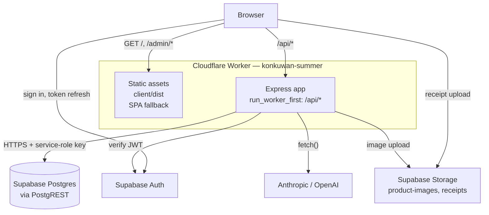
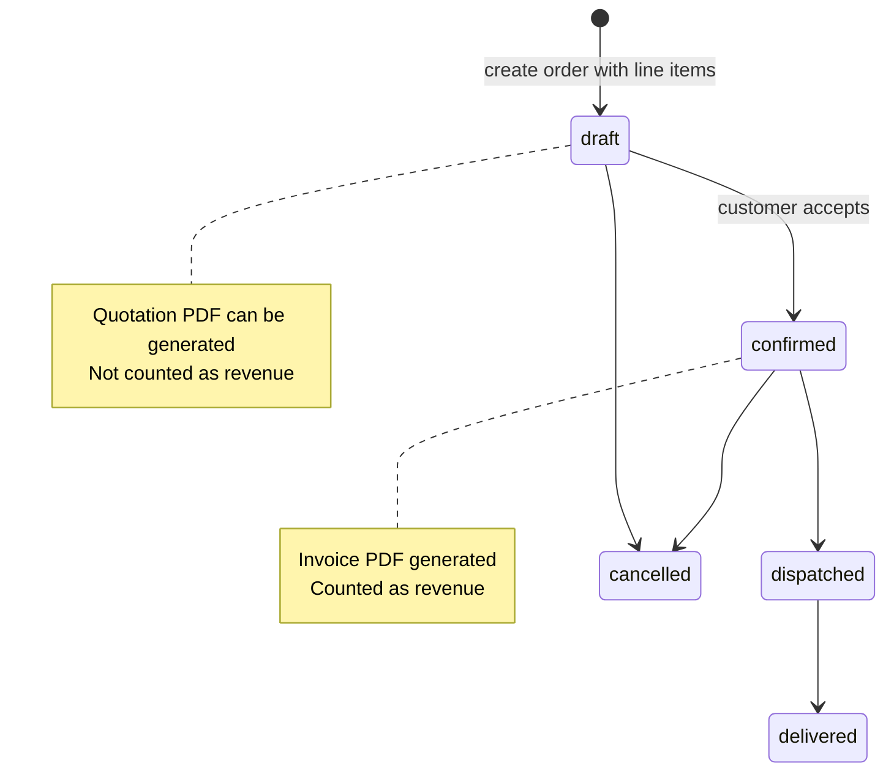
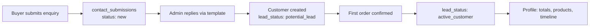
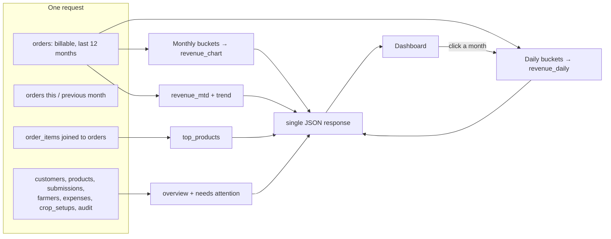
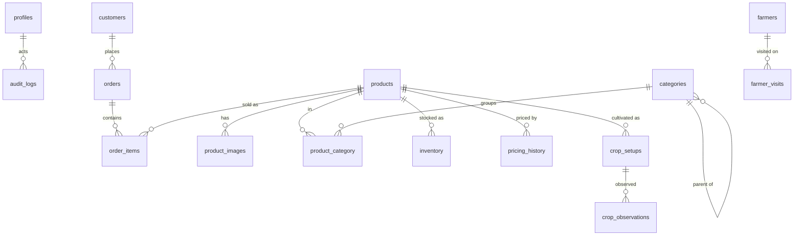

# Architecture — Konkuwan Herbs
 
**Status:** living document · **Baseline:** current `main` · **Last updated:** 2026-08-02
 
Related: [PRD.md](./PRD.md) · [RULES.md](./RULES.md) · [Design.md](./Design.md) · [Memory.md](./Memory.md)
 
---
 
## 1. High-level architecture
 
One Cloudflare Worker serves both halves of the application. Static assets are served straight from Cloudflare's asset store; only `/api/*` invokes the Worker, where the existing Express app runs unmodified.
 

 
**Why one Worker.** Same origin means no CORS and no cross-service URL configuration — `VITE_API_URL` defaults to the relative `/api`, correct in dev, preview and production. One deploy, one rollback, one log stream. The trade-off is that frontend and backend release together, which suits a single-team internal panel.
 
### Frontend ↔ backend communication
 
- Axios instance (`client/src/services/api.js`) with `baseURL = import.meta.env.VITE_API_URL || '/api'`.
- A request interceptor attaches the current Supabase access token as `Authorization: Bearer <jwt>`.
- A response interceptor signs the user out and redirects to `/admin/login` on any 401.
- TanStack Query owns server state: caching, refetching and invalidation after mutations.
 
### Two paths to the data
 
This is the single most important thing to understand about the system:
 
| Path | Used for | Key |
|---|---|---|
| Browser → Supabase **directly** | Authentication, receipt upload | publishable (anon) key — public, RLS applies |
| Browser → Express → Supabase | Everything else | service-role key — server-only, bypasses RLS |
 
Login therefore works even when the API is completely down — a fact worth remembering when debugging "logged in but no data".
 
---
 
## 2. Technology stack
 
### Frontend
 
| Concern | Choice | Version |
|---|---|---|
| Framework | React | 19 |
| Build tool | Vite | 8 |
| Styling | Tailwind CSS | 4 (via `@tailwindcss/vite`) |
| Routing | react-router-dom | 7 |
| Server state | @tanstack/react-query | 5 |
| HTTP | axios | 1 |
| i18n | i18next + react-i18next | 26 / 17 |
| Charts | Recharts | 3 |
| PDF | jsPDF + jspdf-autotable | 4 / 5 |
| CSV | PapaParse | 5 |
| Icons | react-icons | 5 |
| Supabase client | @supabase/supabase-js | 2 |
 
### Backend
 
| Concern | Choice |
|---|---|
| Runtime | Node ≥ 20 locally; Cloudflare Workers (`nodejs_compat`) in production |
| Framework | Express 4 |
| Data access | `@supabase/supabase-js` over HTTPS/PostgREST |
| Validation | Joi 17 |
| Security headers | helmet |
| File upload | multer (memory storage) |
| Slugs | slugify |
| Config | dotenv (local only) |
 
**No ORM.** Sequelize and `pg` were removed. There is no SQL connection: all data access goes through the Supabase REST API, which is what makes the Express app deployable to Workers at all.
 
### Infrastructure
 
| Concern | Choice |
|---|---|
| Hosting | Cloudflare Workers (Static Assets + Worker script) |
| CI/CD | Cloudflare Workers Builds, Git-connected |
| Database | Supabase (managed Postgres) |
| Auth | Supabase Auth |
| Object storage | Supabase Storage |
| TLS/DNS | Cloudflare Universal SSL |
| Package manager | npm (separate `client/` and `server/` packages) |
 
---
 
## 3. Folder structure
 
```
konkuwan_summer/
├── wrangler.jsonc          Cloudflare config: assets dir, nodejs_compat, joi alias, vars
├── worker.js               Worker entry — bridges Workers fetch to the Express app
├── PRD.md Architecture.md RULES.md Phases.md Design.md Memory.md
│
├── client/                 React SPA (own package.json / node_modules)
│   ├── index.html          Vite template — NOT the deployed page
│   ├── vite.config.js      Plugins + /api dev proxy to :5500
│   ├── tailwind.config.js  Brand colour and font tokens
│   ├── public/             Copied verbatim (favicon, icons)
│   ├── dist/               BUILD OUTPUT — what Cloudflare serves. Gitignored.
│   └── src/
│       ├── App.jsx         Route table, public + admin
│       ├── main.jsx        Root render, providers, i18n bootstrap
│       ├── assets/         Images imported by components (hashed at build)
│       ├── components/
│       │   ├── ui/         Presentational primitives: Button, Input, Modal,
│       │   │               DataTable, Pagination, Select, StatusBadge, …
│       │   ├── layout/     Navbar, Footer, PublicLayout, AdminLayout, MobileMenu
│       │   └── admin/      Sidebar, OrderDetail, KPICard
│       ├── contexts/       AuthContext — session, profile, language
│       ├── hooks/          Shared React hooks
│       ├── i18n/           index.js + locales/en.json, or.json
│       ├── lib/            Non-React logic: supabase client, invoice.js (PDF),
│       │                   imageUrl.js, reply-template builders
│       ├── pages/          Public pages at the root, admin panel under admin/
│       └── services/       api.js — axios instance and interceptors
│
├── server/                 Express API (own package.json / node_modules)
│   ├── diagnose.js         Connection diagnostic — env, DNS, REST, API, AI key
│   └── src/
│       ├── server.js       Local entry: app.listen + graceful shutdown
│       ├── app.js          Express app: middleware, route mounts, error handler
│       ├── config/         index.js (env + validation), supabaseAdmin.js,
│       │                   supabase.js
│       ├── routes/         One file per resource, thin — auth guard + handler
│       ├── controllers/    Request handling and business logic
│       ├── middlewares/    auth.js, upload.js, errorHandler.js, notFound.js
│       ├── validations/    Joi schemas, one per resource
│       └── utils/          AppError, audit, logger, orderStatus
│
└── database/
    ├── supabaseSchema.sql          Full schema — run first on a new project
    ├── schema.sql                  Legacy reference
    └── 2026-07-13_user_language.sql  Migration: profiles.language
```
 
**`shared/` does not exist.** The client and server share no code — they are separate npm packages with no build-time link. Contracts are shared only as JSON over HTTP.
 
---
 
## 4. Application flows
 
### 4.1 Authentication
 
```mermaid
sequenceDiagram
  participant U as User
  participant C as React client
  participant SA as Supabase Auth
  participant API as Express API
 
  U->>C: email + password
  C->>SA: signInWithPassword (publishable key)
  SA-->>C: session { access_token }
  C->>C: store session, apply profile.language
  U->>C: open Orders
  C->>API: GET /api/admin/orders + Bearer token
  API->>SA: auth.getUser(token) (service key)
  SA-->>API: user
  API->>API: load profiles row; reject if missing or inactive
  API-->>C: 200 data
  Note over C,API: any 401 → signOut() → /admin/login
```
 
### 4.2 Order → quotation → invoice
 

 
Numbering runs on the Indian financial year (April–March):
 
| Document | Format | Example |
|---|---|---|
| Invoice | `KON/<FY>/<n>` | `KON/2026-27/01` |
| Quotation | `K/<FY>/K<n>` | `K/2026-27/K1` |
| Challan | `CH/<FY>/<n>` | `CH/2026-27/001` |
 
PDFs are generated **client-side** by `client/src/lib/invoice.js`: the API returns a shaped JSON document and jsPDF renders it. This keeps PDF work off the Worker's CPU budget.
 
### 4.3 Delivery challan
 
Reverse of an invoice — the company receives, the farmer supplies. `Received By` is the company, `Supplied By (Farmer)` the farmer. Goods value and challan charges are shown separately, and the document carries signature lines because it is physically signed on handover.
 
### 4.4 Customer lifecycle
 

 
### 4.5 Farmer lifecycle
 
Enrol (crop, area, seed date, type) → weekly visits logged with status and notes → observations recorded per crop → produce procured via a Delivery Challan → expense recorded in Finance. A farmer with no visit in 14 days appears in the dashboard's "Needs attention" panel.
 
### 4.6 Dashboard data flow
 

 
`revenue_chart` and `revenue_daily` derive from the *same* result set, so month → day drill-down issues no extra request and the two views cannot disagree.
 
---
 
## 5. API architecture
 
### Route organisation
 
Routes are thin. Each file authenticates, authorises, and delegates:
 
```js
const router = require('express').Router();
const { authenticate, authorize } = require('../middlewares/auth');
router.use(authenticate);
router.get('/', controller.list);
router.post('/', authorize('super_admin', 'order_manager'), controller.create);
module.exports = router;
```
 
| Mount | File | Access |
|---|---|---|
| `/api/health` | inline in `app.js` | public |
| `/api/me` | `me.routes` | authenticated |
| `/api/products`, `/api/categories` | `*.public.routes` | public |
| `/api/contact` | `contact.public.routes` | public |
| `/api/admin/*` | `*.admin.routes` | authenticated, role-gated |
 
Full endpoint list: run `grep -rE "router\.(get|post|put|patch|delete)" server/src/routes/`.
 
### Layers
 
```
routes/       HTTP surface: method, path, auth guard
controllers/  Validate → query Supabase → shape response → audit
validations/  Joi schemas, stripUnknown so unknown keys cannot break updates
middlewares/  Cross-cutting: auth, upload, 404, error handler
utils/        AppError, audit, logger, orderStatus
config/       Env loading and validated Supabase clients
```
 
There is no separate service layer — controllers talk to Supabase directly. At this size the indirection would cost more than it saves. Shared rules that *must not* diverge live in `utils/` (`orderStatus.js` is the example).
 
### Validation
 
Joi schemas with `stripUnknown: true`. This matters: the client often round-trips a whole row including `id` and `created_at`, and without stripping, every update would fail.
 
### Error handling
 
Controllers throw or forward `AppError(message, statusCode)`. `middlewares/errorHandler.js` is the single exit point: it logs, and returns `{ success: false, message }` — including a stack trace only when `NODE_ENV === 'development'`.
 
### Audit logging
 
`utils/audit.js` writes to `audit_logs` on create/update/delete across modules, capturing actor, action, entity, new values and IP. Failures are swallowed so auditing never breaks a request.
 
---
 
## 6. Database architecture
 
Supabase Postgres, reached over PostgREST. The server uses the service-role key and therefore bypasses RLS by design — it is the trusted tier.
 
### Entities
 

 
### Table groups
 
| Group | Tables |
|---|---|
| Identity | `profiles`, `roles`, `user_roles`, `users` (legacy) |
| Catalogue | `products`, `product_images`, `categories`, `product_category`, `pricing_history`, `inventory` |
| Sales | `customers`, `orders`, `order_items` |
| Farm | `farmers`, `farmer_visits`, `crop_setups`, `crop_observations`, `war_room_briefs` |
| Finance | `expenses`, `cash_balance` |
| Platform | `settings`, `audit_logs`, `contact_submissions` |
 
`profiles` is the join to Supabase Auth: `profiles.id` equals `auth.users.id`, and carries `role`, `is_active` and `language`.
 
### Migrations
 
Plain SQL run manually in the Supabase SQL editor, named `YYYY-MM-DD_description.sql`. `supabaseSchema.sql` is the full baseline for a fresh project. There is no migration runner — apply files in date order.
 
---
 
## 7. Deployment architecture
 
### Build and deploy
 
Cloudflare Workers Builds, connected to the repository:
 
| Field | Value |
|---|---|
| Root directory | `/` |
| Build command | `npm --prefix server ci && npm --prefix client ci && npm --prefix client run build` |
| Deploy command | `npx wrangler deploy` |
 
`npm ci` (not `install`) keeps builds reproducible from the lockfiles.
 
### Routing
 
`wrangler.jsonc` sets `assets.directory` to `client/dist`, `not_found_handling` to `single-page-application` so deep links resolve, and `run_worker_first: ["/api/*"]` so static files never invoke the Worker.
 
Two settings are load-bearing and easy to get wrong:
 
- **`compatibility_flags: ["nodejs_compat"]`** with a compatibility date ≥ 2025-08-15 — required for `node:http`, and therefore for Express.
- **`alias: { "joi": "./server/node_modules/joi/lib/index.js" }`** — Joi's `browser` field points at a prebuilt bundle with the TLD list stripped, which throws the moment `.email()` is evaluated.
 
### Environment variables
 
Two mechanisms, easy to confuse:
 
| Type | Where | When it exists | What belongs there |
|---|---|---|---|
| **Worker secret** | Worker → Settings → Variables and Secrets | request time (`process.env`) | `SUPABASE_URL`, `SUPABASE_SERVICE_ROLE_KEY`, `OPENAI_API_KEY`, `CLAUDE_API_KEY` |
| **Build variable** | Workers Builds → Build variables | only during `vite build` | `VITE_SUPABASE_URL`, `VITE_SUPABASE_ANON_KEY` |
| **Plain var** | `wrangler.jsonc` → `vars` | request time | `NODE_ENV`, `AI_PROVIDER` |
 
Vite inlines `VITE_*` into the bundle at build time, so those values are **public** — only the anon key may appear there. A Worker secret does not exist during the build; setting `VITE_*` as a secret ships a client with `undefined` config.
 
`config/index.js` aborts startup when `SUPABASE_URL` or `SUPABASE_SERVICE_ROLE_KEY` is missing under `NODE_ENV=production`. On Workers this runs during deploy validation, so a missing secret fails the deploy rather than shipping a broken Worker.
 
### Local development
 
```bash
npm --prefix server run dev     # Express on :5500, reads server/.env
npm --prefix client run dev     # Vite on :5173, proxies /api → :5500
npx wrangler dev                # the real Workers runtime, reads .dev.vars
```
 
`wrangler dev` is the only way to catch Workers-specific failures — bundling problems and module-scope throws are invisible to `wrangler deploy --dry-run`, which bundles but never executes.
 
### Static assets and caching
 
Vite fingerprints filenames, so Cloudflare's edge cache invalidates naturally on deploy; no purge needed. Product images live in Supabase Storage and are stored as absolute URLs. Rows predating that change hold relative `/uploads/...` paths; `app.js` still serves those locally when the directory exists.
 
### Diagnostics

`node server/diagnose.js` walks every hop — env loaded, key role, DNS, PostgREST row counts per table, `/api/health`, an authenticated endpoint, AI key — and reports the first break. It talks to PostgREST directly, so `supabase-js` is not in the picture, and prints only key prefixes.