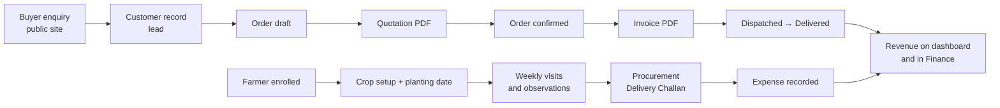

# PRD — Konkuwan Herbs B2B Platform
 
**Status:** living document · **Baseline:** current `main` · **Last updated:** 2026-08-02
 
Related: [Architecture.md](./Architecture.md) · [Phases.md](./Phases.md) · [Design.md](./Design.md) · [RULES.md](./RULES.md) · [Memory.md](./Memory.md)
 
---
 
## 1. Project overview
 
| | |
|---|---|
| **Name** | Konkuwan Herbs — B2B sourcing & farm operations platform |
| **Vision** | Make tribal-belt medicinal herb cultivation a dependable, traceable supply chain that pays farmers fairly and gives buyers consistent quality. |
| **Mission** | Run every step — farmer enrolment, cultivation, procurement, sales and finance — in one system, so decisions rest on live field data rather than memory and spreadsheets. |
| **Business objective** | Aggregate produce from smallholder farmers in Ghotiya, Bastar, sell to bulk buyers (pharma, nutraceutical, ayurvedic manufacturers), and keep working capital visible against the project's EMI obligations. |
 
### Target users
 
| User | Uses the platform to |
|---|---|
| **Founder / Director** | See revenue, cash position and project health; approve pricing; decide deployment of capital |
| **Order manager** | Manage customers, raise quotations, confirm orders, issue invoices |
| **Product manager** | Maintain the catalogue, pricing and imagery shown on the public site |
| **Farm manager / Field coordinator** | Enrol farmers, log visits and observations, record procurement and expenses |
| **Buyer (external)** | Browse products on the public site and submit a sourcing enquiry |
| **Investor (external)** | Submit an investment enquiry through the public site |
 
### User personas
 
**Rajeshwar — COO, founder.** Needs a single screen answering "how much came in this month, what is going out, and what needs my attention today". Works from a laptop, often on the move. Cares about cash runway against EMI.
 
**Roopali — CEO, rural livelihoods background.** Focused on farmer coverage and welfare: how many farmers per crop, who has not been visited, how much area is under cultivation.
 
**Field coordinator (CRP).** Lower digital literacy, works in Odia, enters data from the field. Needs short forms, forgiving validation, and the interface in their own language.
 
**Buyer procurement lead.** Wants product specifications, quantities and a fast reply. Judges the company by the professionalism of the quotation and invoice.
 
### Key business workflows
 

 
---
 
## 2. Problem statement
 
Medicinal-herb sourcing from tribal belts fails on three fronts at once.
 
**Buyers cannot rely on supply.** Volumes and quality vary between seasons because nobody tracks what is actually in the ground until harvest.
 
**Farmers carry all the risk.** Without contracted demand and advisory support, they plant on guesswork and sell to whoever turns up.
 
**The aggregator flies blind.** Procurement costs, field visits, sales and cash sit in separate notebooks and spreadsheets, so nobody can answer "are we profitable this month" without a day of reconciliation — and the EMI is due regardless.
 
The platform closes the loop: what is planted is recorded, what is procured is costed, what is sold is invoiced, and all three land on one dashboard.
 
---
 
## 3. Goals
 
### Short-term
 
- [x] Single admin panel covering products, customers, orders, invoicing and farm operations
- [x] Professional GST invoices and quotations generated as PDFs
- [x] Farm operations tracked per crop and per farmer, including visits
- [x] Finance view reconciling logged revenue, product sales and expenses against EMI
- [x] Public website with buyer and investor enquiry capture
- [x] Odia interface for field staff
- [ ] Production deployment on a custom domain
 
### Long-term
 
- Contract cultivation at scale with per-farmer forecasting
- Traceability from buyer order back to the farmer and plot that supplied it
- Advisory automation — package-of-practice reminders pushed to field staff
- Inventory and warehouse management
- Buyer self-service portal for repeat orders
 
---
 
## 4. Functional requirements
 
Each module below is **implemented** unless marked otherwise.
 
### 4.1 Dashboard
 
**Purpose.** One screen answering the daily "what happened and what needs me".
 
**Features.** Three KPI cards (Revenue MTD, Orders MTD, Total customers) each with a month-on-month trend; a six-card operational strip (products, potential leads, new inquiries, farmers, cultivated area, farm expenses); a "Needs attention" panel; a 12-month revenue chart with day-level drill-down; top products this month; recent orders; order-status distribution; recent audit activity.
 
**User interactions.** Every card links to its module. Clicking a month in the revenue chart expands it into a day-by-day view; "← Back to 12 months" returns.
 
**Business rules.**
- Revenue counts orders in `confirmed`, `dispatched` or `delivered` — see [§4.7](#47-orders). Drafts and cancellations are excluded.
- "Needs attention" surfaces new inquiries, draft orders and farmers with no visit in 14 days, ordered by severity.
- The daily series is derived from the same query as the monthly one, so drill-down costs no extra request.
 
**Dependencies.** Orders, order items, customers, products, contact submissions, farmers, expenses, crop setups, audit logs.
 
### 4.2 Authentication
 
**Purpose.** Restrict the admin panel to invited staff.
 
**Features.** Email/password sign-in via Supabase Auth; invite-by-email for new users; set-password page reached from the invite link; change password from Account settings.
 
**User interactions.** Sign in at `/admin/login`. An invited user receives an email, sets a password at `/set-password`, then signs in.
 
**Business rules.**
- The client authenticates directly against Supabase; the API only *verifies* the resulting JWT and never issues its own.
- A profile row must exist and be `is_active` or the request is rejected.
- A 401 from any API call signs the user out and returns them to the login page.
 
**Dependencies.** Supabase Auth, `profiles` table.
 
### 4.3 Users & roles
 
**Purpose.** Give each staff member the access their job needs.
 
**Roles.** `super_admin`, `product_manager`, `order_manager`, `farm_manager`, `viewer`.
 
**Features.** List users, invite by email with a role, edit name/role/active flag, deactivate.
 
**Business rules.** Users and Settings are visible only to `super_admin`. Deactivation is preferred over deletion so audit history stays attributable.
 
**Dependencies.** Supabase Auth admin API, `profiles`.
 
### 4.4 Customers
 
**Purpose.** The buyer book — both live accounts and leads.
 
**Features.** Paginated list (20/page) with search and lead-status filter; total purchase amount per customer; create/edit/delete; CSV export and import; a profile page showing purchase summary, products bought and an order timeline.
 
**Business rules.**
- `lead_status` is `potential_lead` or `active_customer`.
- Deletion is blocked when orders reference the customer; the API returns 409 with an explanation.
- Only editable fields are accepted on update; unknown keys are stripped.
 
**Dependencies.** Orders (for totals and history).
 
### 4.5 Farmers
 
**Purpose.** The supply-side register.
 
**Features.** Enrol with crop, area, seed date and type; `connected` (contract) vs `independent`; search across name, phone, village, block and crop; coverage bars against editable per-crop targets; profile view with stats and an activity timeline; visit logging; CSV import/export.
 
**Business rules.**
- Crops come from the product catalogue, not a hard-coded list.
- A farmer with no visit in the last 14 days is flagged as needing one.
- Import skips duplicates by phone, or by name within the same village.
 
**Dependencies.** Products (crop options), `farmer_visits`.
 
### 4.6 FarmOps
 
Three tabs plus a briefing tool.
 
**CropOS.** Per-crop cultivation: planting date, cultivated area, generated package of practice, weekly field tasks and observations (health, pest, water, growth).
 
**FarmerOS.** The farmer register described in §4.5.
 
**War Room.** Generates a Monday brief from live crop, expense, farmer and sales data using the configured AI provider. Briefs are saved and re-openable.
 
**Business rules.** Crop setup is keyed uniquely per crop. The AI provider is chosen in Settings and needs the matching API key configured server-side.
 
**Dependencies.** Products, farmers, expenses, cash balance, orders, Anthropic or OpenAI API.
 
### 4.7 Orders
 
**Purpose.** The sales pipeline from draft to delivery.
 
**Features.** Paginated list with status and date filters; create with line items; update status; adjust final unit price per line; generate quotation and invoice PDFs.
 
**Business rules.**
 
| Status | Meaning | Counts as revenue |
|---|---|---|
| `draft` | Being prepared | No |
| `confirmed` | Customer committed, invoiceable | **Yes** |
| `dispatched` | In transit | **Yes** |
| `delivered` | Complete | **Yes** |
| `cancelled` | Did not happen | No |
 
The billable set lives in `server/src/utils/orderStatus.js` and is imported by both Analytics and Finance so the two cannot disagree. There is no refund state in the current schema.
 
**Dependencies.** Customers, products, settings (tax, due days, bank details).
 
### 4.8 Quotations
 
**Purpose.** A priced offer before commitment.
 
**Features.** Generated per order, numbered `K/<FY>/K<n>`, rendered as a branded PDF with parties, line items, total in words and terms. The number is stored on the order and printed on the resulting invoice for traceability.
 
**Business rules.** Numbering runs on the Indian financial year (April–March). Quotation terms come from Settings.
 
### 4.9 Invoices
 
**Purpose.** The GST tax document.
 
**Features.** Generated per order, numbered `KON/<FY>/<n>`, rendered as a PDF with Billed By / Billed To panels, HSN/SAC per line, IGST, shipping, total in words, bank details and terms.
 
**Business rules.** Tax percentage and payment due days come from Settings, not hard-coded. Long addresses wrap inside their panel and the panel grows to fit.
 
### 4.10 Delivery Challans
 
**Purpose.** Record produce bought *from* a farmer — the reverse of an invoice.
 
**Features.** Create against a farmer with line items and challan charges; numbered `CH/<FY>/<n>`; printable PDF with signature lines.
 
**Business rules.** Challan charges cover pickup, transport, loading and other procurement costs, and are shown separately from goods value.
 
**Dependencies.** Farmers, products.
 
### 4.11 Inventory
 
**Status: partial.** An `inventory` table and a reporting endpoint (`GET /api/admin/analytics/inventory`) exist and aggregate stock per product. There is **no** inventory management UI, and stock is not decremented by orders. Full stock control is **planned** — see [Phases.md](./Phases.md).
 
### 4.12 Finance
 
**Purpose.** Answer "can we afford this".
 
**Features.** EMI alert derived from Settings; editable cash position with full update history (timestamp, old → new, user); safe-deploy figure (cash − 2× EMI); revenue this month split into logged revenue and product sales; expenses this month by category; receipt upload; recent transactions.
 
**Business rules.** Product sales use the same billable statuses as the dashboard. EMI values come from Settings; with none configured the alert explains how to set it.
 
**Dependencies.** Expenses, cash balance, orders, settings, Supabase Storage (receipts).
 
### 4.13 Products
 
**Purpose.** The catalogue driving both the public site and internal crop lists.
 
**Features.** Paginated list; create/edit; drag-and-drop ordering persisted to the database; active/inactive toggle; archive and hard delete; image upload to Supabase Storage plus image-by-URL; tags; price range or "on inquiry".
 
**Business rules.** Inactive products disappear from the public site but remain in historical orders. Display order is honoured publicly. Products define the crop list used across FarmOps.
 
### 4.14 Inquiries
 
**Purpose.** Inbox for public enquiries.
 
**Features.** List buyer and investor submissions with status; mark status; delete; reply via a pre-filled email template appropriate to the enquiry type.
 
**Business rules.** New submissions default to `new` and drive the dashboard "Needs attention" count.
 
### 4.15 Reports
 
**Status: API-only.** Endpoints exist for revenue, sales, product performance, customer insights, inventory, order trends and pricing history under `/api/admin/analytics/*`. They are consumed by the dashboard; a dedicated reporting UI is **planned**.
 
### 4.16 Settings
 
**Purpose.** Configuration without code changes. `super_admin` only.
 
**Sections.** Company profile (used on invoices and the public site) · Bank details · AI assistant (provider and models) · Farm finance (EMI amount, start date, label) · Invoicing (tax %, payment due days, invoice and quotation terms).
 
**Business rules.** Every key is a row in `settings`. Unknown keys already present are shown in an "Other settings" section rather than hidden.
 
### 4.17 Notifications
 
**Status: not implemented.** There is no in-app or push notification system. The "Needs attention" panel is the current substitute. Planned — see [Phases.md](./Phases.md).
 
### 4.18 Public website
 
**Purpose.** Establish credibility and capture demand.
 
**Pages.** Home, Products, Supply, Impact, Partners, About, Contact.
 
**Features.** Product catalogue driven by the admin panel, including tags and an "Available" badge for active items.
 
### 4.19 Contact forms
 
**Buyer enquiry.** Name, company, email, phone, searchable multi-select of products, quantity, message.
 
**Investor enquiry.** Name, organisation, email, phone, interest area, message.
 
Both validate server-side with Joi, persist to `contact_submissions`, and appear in the admin inbox.
 
---
 
## 5. Non-functional requirements
 
| Area | Requirement | Current state |
|---|---|---|
| **Performance** | Admin screens interactive in < 2 s on broadband | Client bundle 0.56 MB gzipped, single chunk. Code-splitting planned. |
| **Security** | Service-role key never reaches the browser; all admin routes authenticated; RLS on client-facing tables | Enforced. Server holds the service key; the client only ever gets the publishable key. |
| **Scalability** | Handle the current 10–50 orders/month with headroom | Dashboard aggregates in JS over a 12-month slice; fine at this size, needs SQL aggregation past a few thousand orders. |
| **Accessibility** | Keyboard-navigable, meaningful labels, sufficient contrast | Partial. Semantic landmarks and `aria-label` on key widgets; no formal audit yet. |
| **Reliability** | A misconfiguration should fail loudly at startup, not silently at runtime | Enforced. Missing Supabase credentials abort boot with an actionable message. |
| **Localization** | Full English and Odia interface, per-user | Implemented — 572 keys per locale, persisted on the profile. PDFs remain English (see below). |
| **Maintainability** | Shared business rules defined once | Order status rules centralised; i18n keys namespaced by module. |
 
**Known localization limit.** Generated PDFs render in English regardless of interface language. jsPDF performs no Indic text shaping, so Odia matras and conjuncts would be reordered and unreadable on a legal document. `PDF_LANGUAGES` in `client/src/lib/invoice.js` gates this in one place.
 
---
 
## 6. Future roadmap
 
| Item | Notes |
|---|---|
| Inventory management UI | Stock in/out, decrement on dispatch, low-stock alerts |
| Notifications | In-app and email for new enquiries, overdue visits, EMI due dates |
| Reporting UI | Surface the existing analytics endpoints with date ranges and export |
| Odia PDFs | Requires a shaping-capable renderer; likely an HTML print path |
| Traceability | Link order lines back to the challans and farmers that supplied them |
| Mobile | The admin panel is responsive but not optimised for field data entry; a focused mobile flow for visit logging is the highest-value next step |
| Buyer portal | Self-service reorder and order status |
| Advanced analytics | Yield per acre, cost per kg, farmer profitability |
 
---
 
## 7. Out of scope
 
Payment gateway integration · logistics/courier integration · multi-tenant support · accounting-software sync.