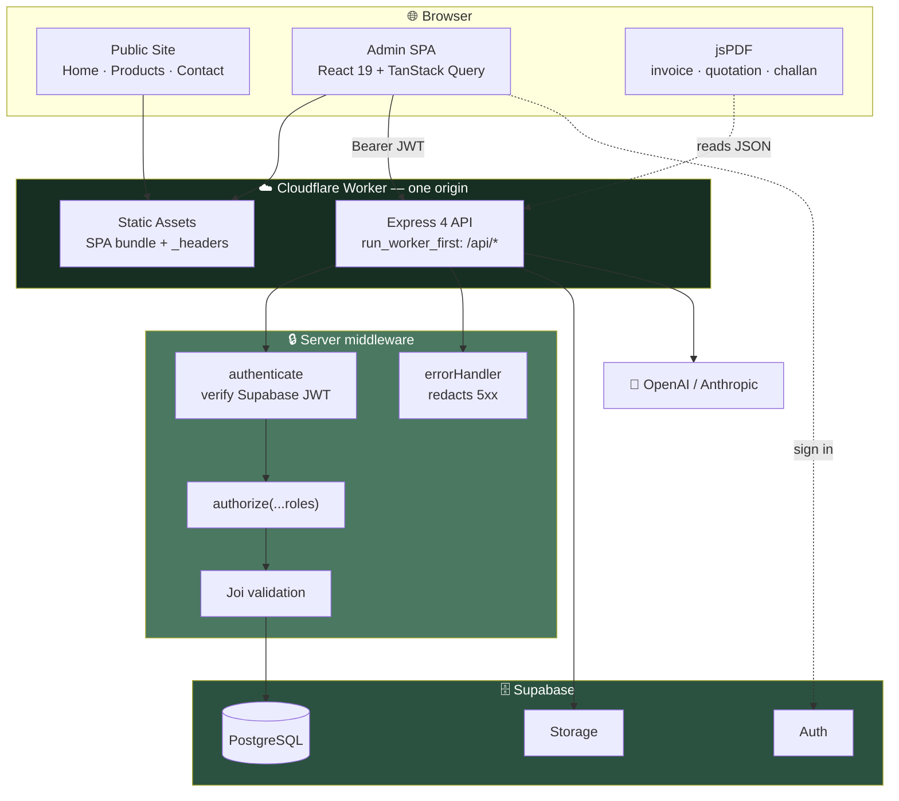
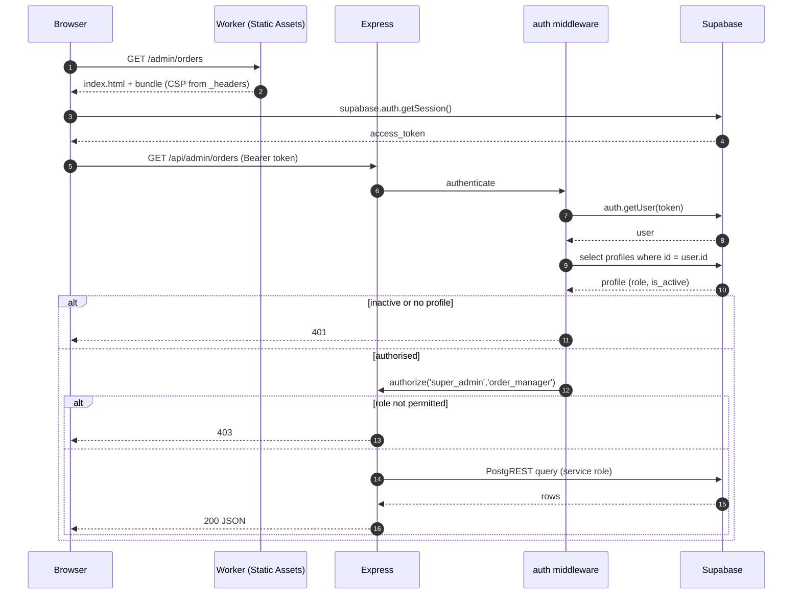
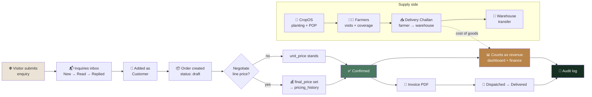
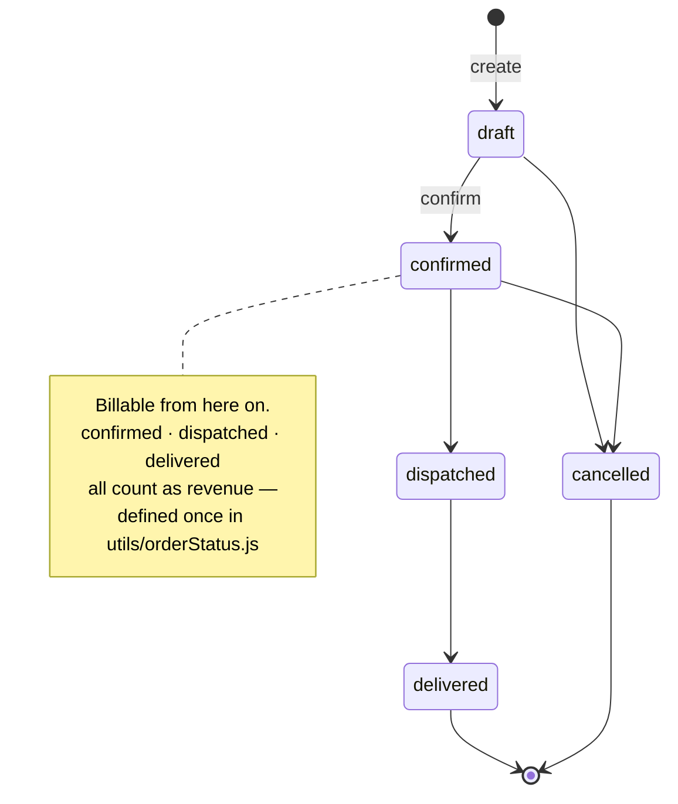
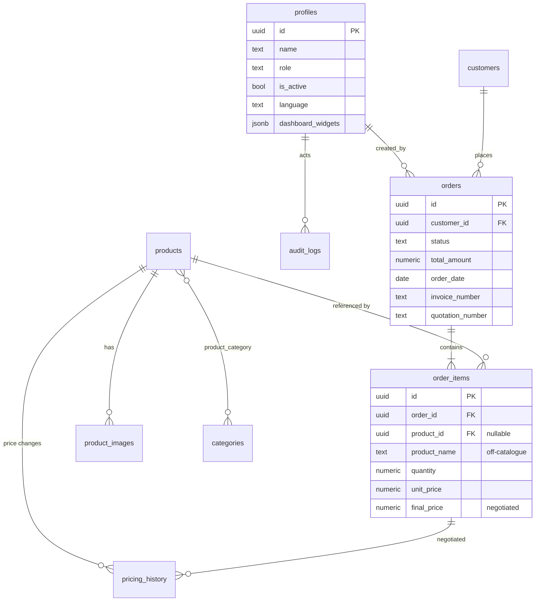
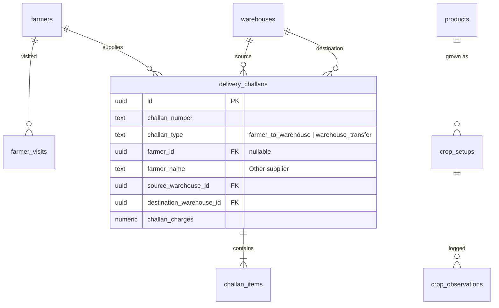
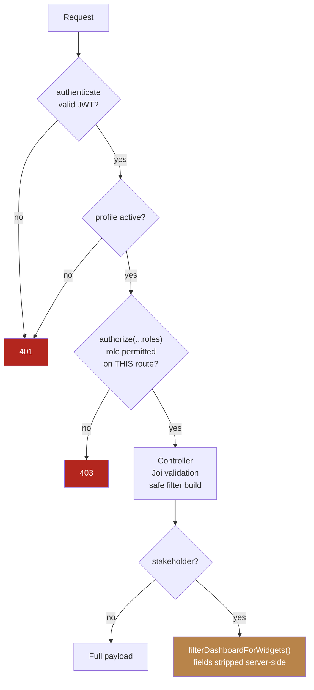

<div align="center">

# 🌿 Konkuwan Herbs — B2B Sourcing & Farm Operations Platform
 
**A single system that runs a medicinal-herb supply business end to end — from the public shop window to the field, the invoice, and the audit trail.**
 
[](https://react.dev/)
[](https://vite.dev/)
[](https://nodejs.org/)
[](https://expressjs.com/)
[](https://supabase.com/)
[](https://workers.cloudflare.com/)
[](https://tailwindcss.com/)
[](#-internationalisation)
[](./DEPLOYMENT.md)
 
</div>
 
---
 
## 📑 Table of Contents
 
| | | |
|---|---|---|
| [Overview](#-overview) | [Problem Statement](#-problem-statement) | [Motivation](#-motivation) |
| [Features](#-features) | [Tech Stack](#-tech-stack) | [Architecture](#-architecture) |
| [Folder Structure](#-folder-structure) | [System Workflow](#-system-workflow) | [Modules](#-project-modules) |
| [Database Schema](#-database-schema) | [API Reference](#-api-reference) | [Security](#-security-model) |
| [Getting Started](#-getting-started) | [Configuration](#-configuration) | [Build & Deploy](#-build--deployment) |
| [Usage Guide](#-usage-guide) | [Screenshots](#-screenshots) | [Design Decisions](#-design-decisions) |
| [Challenges](#-challenges-faced) | [Roadmap](#-future-enhancements) | [Contributing](#-contributing) |
 
---
 
## 🌱 Overview
 
**Konkuwan Herbs Pvt. Ltd.** is a B2B supplier of medicinal herbs, spices and superfoods, sourcing directly from farming families across several Indian states and selling to herbal manufacturers, exporters and processors. The company's model depends on removing intermediaries: it plans cultivation, supports farmers, collects and grades harvest, and sells the graded material onward.
 
That model spans two worlds that normally live in different software — **a public brand and sales presence**, and **a back-office that runs procurement, orders and the farms**. This platform unifies both into one deployable application.
 
> [!NOTE]
> **What makes this more than a CRUD admin panel:** negotiated pricing is a first-class database concept, the reporting calendar is the **Indian financial year** rather than the Gregorian one, procurement from farmers is modelled as a **delivery challan** distinct from a sales order, and an external **stakeholder** role can be granted individual dashboard metrics — enforced server-side, not by hiding cards.
 
| | |
|---|---|
| **Domain** | B2B agricultural commodity supply |
| **Users** | Company staff (5 internal roles) + external stakeholders |
| **Surfaces** | Public marketing site · Admin panel · PDF documents |
| **Deployment** | Single Cloudflare Worker (primary) · Docker container (self-host) |
| **Scale of code** | ~4,150 lines server · ~8,000 lines client · 98 API routes · 681 translated strings × 3 languages |

---

## 🎯 Problem Statement
 
Before this system existed, the business ran on a static HTML website and informal record-keeping. Each gap below is a concrete failure mode that cost money or trust.
 
| # | Gap | Consequence |
|---|---|---|
| 1 | **Leads arrived by email and phone** | Enquiries were lost in inboxes; no record of what was quoted |
| 2 | **Catalogue lived in HTML files** | Adding a product or changing a price needed a developer |
| 3 | **Negotiated prices were unrecorded** | Konkuwan advertises a *range* and negotiates per order — the actual price agreed existed only in memory, making revenue unreportable |
| 4 | **No customer record** | Buyer companies, contacts and pipeline stage lived in a notebook |
| 5 | **Farm activity was invisible** | Planting dates, farmer visits, field observations and cash position were untracked |
| 6 | **Procurement was undocumented** | Buying crop from a farmer produced no document, so cost of goods was unknown |
| 7 | **No access control** | Any change meant editing source; no separation between viewing and changing |
| 8 | **No audit trail** | No record of who changed a price or an order status, or when |

---

## 💡 Motivation
 
Three things made this worth building properly rather than buying an off-the-shelf ERP:

1. **The pricing model does not fit standard software.** Almost every B2B herb order is negotiated away from the listed range. Generic e-commerce and invoicing tools assume a fixed price per SKU. Modelling `unit_price` and `final_price` as separate fields, with an append-only `pricing_history`, was the single most important schema decision in the project.

2. **The reporting calendar is the Indian financial year.** Indian businesses report on 1 April – 31 March, with quarters Q1 Apr–Jun through Q4 Jan–Mar. Every off-the-shelf dashboard reports on calendar months and years, which makes its output useless for filing and for board reporting.

3. **The supply side and the sales side are one business.** Revenue from an order and the cost of the crop that fulfilled it belong in the same system. Splitting them across a CRM and a spreadsheet is precisely how margin becomes invisible.

---

## ✨ Features
 
<table>
<tr><td width="50%" valign="top">
 
### 🛒 Commerce
- Product catalogue with images, botanical names, price ranges, HSN codes
- Drag-and-drop display ordering, reflected on the public site
- Order lifecycle: Draft → Confirmed → Dispatched → Delivered / Cancelled
- **Per-line negotiated final price** with full history
- **Off-catalogue line items** — sell a one-off crop without polluting the catalogue
- Branded **GST invoice** and **quotation** PDFs
- Customer CRM with lead pipeline, CSV import/export, purchase totals
 
</td><td width="50%" valign="top">
 
### 🚜 Farm Operations
- **CropOS** — crops derived from products, cultivated area, planting date, week counter
- **AI-generated Package of Practices** (week-specific field tasks)
- Weekly observation log: health, pest, water, growth
- **FarmerOS** — enrolment, coverage vs target, visit logging, profile timeline, CSV import/export
- **Finance** — cash position with history, EMI alerting, expenses with receipts
- **War Room** — AI weekly briefing from live farm and finance data
 
</td></tr>
<tr><td width="50%" valign="top">
 
### 📦 Procurement & Logistics
- **Delivery Challan**, two distinct types:
  - *Farmer → Warehouse* (procurement, with logistics charges)
  - *Warehouse → Warehouse* (internal stock transfer)
- "Other" farmer — record a one-off supplier without creating a permanent record
- Warehouse registry with activation state
- Printable challan PDF per type
 
</td><td width="50%" valign="top">
 
### 📊 Governance & Insight
- **Financial-year dashboard** — Annual / Quarterly / Monthly, all widgets synchronised
- Revenue chart with **month → day drill-down**
- Customer purchase analytics with sorting and paging
- **Audit log** of every mutation, with CSV export honouring filters
- **Stakeholder role** with per-user, server-enforced widget grants
- **Trilingual UI** — English, Odia, Hindi
 
</td></tr>
</table>

---
 
## 🛠 Tech Stack
 
| Layer | Technology | Why this choice |
|---|---|---|
| **UI** | React 19, Vite 8 | SPA for both public site and admin; Vite for fast builds and native ESM |
| **Styling** | Tailwind CSS 4 | Utility-first, matching the original site's design language |
| **Routing** | React Router 7 | Client-side routing with nested role-guarded routes |
| **Server state** | TanStack Query 5 | Caching, invalidation and pagination without hand-rolled state |
| **Charts** | Recharts 3 | SVG charts — line, bar, pie — with click-through interaction |
| **PDF** | jsPDF 4 + autoTable 5 | **Client-side** generation keeps PDF CPU off the Worker |
| **CSV** | PapaParse 5 | Streaming parse for bulk import; guarded output for export |
| **i18n** | i18next 26 + react-i18next 17 | Runtime language switching, persisted per user |
| **API** | Node 22, Express 4 | Small, well-understood; runs on Workers via `httpServerHandler` |
| **Validation** | Joi 17 | Schema validation with conditional (`.when()`) rules per document type |
| **Security headers** | Helmet 7 | API headers; page headers generated at build time |
| **Database** | PostgreSQL via **Supabase** | Managed Postgres reached over HTTPS — the property that makes it deployable to Workers |
| **Auth** | Supabase Auth (JWT) | Verified server-side on every request |
| **Storage** | Supabase Storage | Product images and expense receipts |
| **AI** | OpenAI *or* Anthropic | Pluggable provider, switched in Settings |
| **Hosting** | Cloudflare Workers + Static Assets | One origin, no CORS, global edge |
| **Container** | Docker (multi-stage, non-root) | Self-hosting and production-like local testing |
 
> [!IMPORTANT]
> **There is no ORM.** All database access goes through Supabase's PostgREST client over HTTPS. This is not a stylistic preference — a traditional SQL connection pool cannot run on Cloudflare Workers without Hyperdrive or a container. Removing Sequelize was a prerequisite for the deployment target.

---

## 🏗 Architecture
 
### High-level
 

 
### Why a single Worker
 
Serving the SPA and the API from one origin removes CORS configuration entirely and lets `VITE_API_URL` default to a relative `/api` that is correct in development, preview and production. `run_worker_first: ["/api/*"]` in `wrangler.jsonc` routes only API paths through Express; everything else is served by Workers Static Assets without touching Node.
 
The cost is that frontend and backend release together. For a single-team internal panel that is an acceptable trade.
 
### Request lifecycle
 


> [!WARNING]
> The server uses the **service-role key**, which bypasses Row-Level Security. That makes the `authenticate` → `authorize` → validated-query chain the *only* thing protecting data. This is why the filter-string builder (`utils/pgrst.js`) exists — see [Design Decisions](#-design-decisions).

---

## 📁 Folder Structure

```
konkuwan_summer/
├── client/                          # React SPA — public site + admin panel
│   ├── src/
│   │   ├── components/
│   │   │   ├── admin/               # Sidebar, KPICard, OrderDetail, CustomerPurchaseChart
│   │   │   ├── layout/              # AdminLayout, PublicLayout, Navbar, Footer
│   │   │   ├── ui/                  # Button, Modal, DataTable, Pagination, StatusBadge…
│   │   │   ├── ErrorBoundary.jsx    # Catches render errors (was a white page)
│   │   │   └── ProtectedRoute.jsx   # Role-guarded route wrapper
│   │   ├── contexts/AuthContext.jsx # Session + language bootstrap
│   │   ├── i18n/
│   │   │   ├── index.js             # SUPPORTED_LANGUAGES, persistence
│   │   │   └── locales/             # en.json · or.json · hi.json (681 keys each)
│   │   ├── lib/
│   │   │   ├── accessControl.js     # Role → route table, mirrors server authorize()
│   │   │   ├── invoice.js           # jsPDF: invoice, quotation, challan
│   │   │   ├── revenueSeries.js     # Chart series + drill-down rule (pure, testable)
│   │   │   ├── csv.js               # CSV export with formula-injection guard
│   │   │   └── safeUrl.js           # Blocks javascript: in href
│   │   ├── pages/
│   │   │   ├── admin/               # 14 admin screens incl. Farm/
│   │   │   └── *.jsx                # 7 public pages
│   │   └── services/api.js          # Axios + Bearer interceptor
│   ├── vite-plugin-headers.js       # Emits dist/_headers (CSP) at build time
│   └── vite.config.js
│
├── server/
│   └── src/
│       ├── app.js                   # Express wiring — 16 routers, SPA fallback
│       ├── server.js                # Node entry + graceful shutdown
│       ├── config/                  # dotenv load order, Supabase clients
│       ├── controllers/             # 13 controllers
│       ├── middlewares/             # auth, errorHandler, upload, notFound
│       ├── routes/                  # 16 route files, 98 endpoints
│       ├── utils/
│       │   ├── pgrst.js             # Safe PostgREST filter construction
│       │   ├── financialYear.js     # FY boundaries, quarters, clamping
│       │   ├── dashboardWidgets.js  # Stakeholder widget registry + filter
│       │   ├── pagination.js        # Clamped page/limit
│       │   ├── orderStatus.js       # Shared billable-status list
│       │   └── imageType.js         # Magic-byte image sniffing
│       └── validations/             # 8 Joi schema files
│
├── database/                        # SQL schema + dated migrations
├── worker.js                        # Cloudflare entry (httpServerHandler)
├── wrangler.jsonc                   # Worker + Static Assets config
├── Dockerfile                       # Multi-stage, non-root, healthcheck
├── docker-compose.yml
└── docs/                            # PRD · Architecture · RULES · Phases · Design · Memory · AUDIT · DEPLOYMENT
```

---

## 🔄 System Workflow
 
The end-to-end story, from a stranger on the website to a filed audit record:
 

 
### Order state machine
 


> [!NOTE]
> **Why "billable" is a shared constant.** The dashboard once filtered on `status === 'delivered'` while the Finance page used all three billable statuses. The two screens disagreed about revenue. `utils/orderStatus.js` now defines the list once, and both import it.

---

## 🧩 Project Modules
 
| # | Module | Route | Roles with access | Key capability |
|---|---|---|---|---|
| 1 | **Dashboard** | `/admin` | super_admin, order_manager, viewer, **stakeholder** | FY-based KPIs, revenue drill-down, alerts |
| 2 | **Products** | `/admin/products` | super_admin, product_manager | Catalogue, images, drag-order, archive/delete |
| 3 | **Orders** | `/admin/orders` | super_admin, order_manager | Lifecycle, negotiated pricing, invoice, quotation |
| 4 | **Customers** | `/admin/customers` | super_admin, order_manager | CRM, pipeline, CSV, purchase analytics |
| 5 | **Customer Profile** | `/admin/customers/:id` | super_admin, order_manager | Order history, products bought, totals |
| 6 | **Inquiries** | `/admin/inquiries` | super_admin, order_manager | Lead inbox, status workflow, reply templates |
| 7 | **Delivery Challans** | `/admin/challans` | super_admin, farm_manager, order_manager | Procurement + stock transfer documents |
| 8 | **Warehouses** | `/admin/warehouses` | super_admin, farm_manager, order_manager | Location registry |
| 9 | **Finance** | `/admin/finance` | super_admin, farm_manager | Cash position, EMI, expenses, receipts |
| 10 | **Farm Ops — CropOS** | `/admin/farm` | super_admin, farm_manager | Crops, area, POP, observations |
| 11 | **Farm Ops — FarmerOS** | `/admin/farm` | super_admin, farm_manager | Enrolment, coverage, visits, timeline |
| 12 | **Farm Ops — War Room** | `/admin/farm` | super_admin, farm_manager | AI weekly brief |
| 13 | **Users** | `/admin/users` | super_admin | Invite, roles, stakeholder widget grants |
| 14 | **Audit Logs** | `/admin/audit-logs` | super_admin, order_manager, viewer | Filterable trail + CSV export |
| 15 | **Settings** | `/admin/settings` | super_admin | Company, bank, AI provider, EMI, invoicing |
| 16 | **My Account** | `/admin/account` | all | Language preference, password change |
 
---
 
## 🗄 Database Schema
 
### Entity relationships (core commerce)
 


### Entity relationships (supply side)
 


### Table reference
 
| Table | Purpose | Notes |
|---|---|---|
| `profiles` | Identity, role, language, stakeholder widget grants | Extends Supabase `auth.users` |
| `categories` | Product categories | Self-referencing `parent_id` |
| `products` | Catalogue: name, botanical name, forms, price range, HSN, unit | |
| `product_images` | Images per product | `is_primary`, `sort_order` |
| `product_category` | Product ↔ category junction | Many-to-many |
| `inventory` | Lot-level stock | ⚠️ **Defined but not surfaced in the UI** |
| `customers` | Buyer companies, GSTIN, `lead_status`, LinkedIn | |
| `orders` | One per transaction; status-constrained | Invoice + quotation numbers |
| `order_items` | Line items | `product_id` **nullable** + `product_name` for off-catalogue lines |
| `pricing_history` | Append-only price-change log | The audit trail for negotiation |
| `audit_logs` | Generic mutation trail with JSONB old/new | Exportable to CSV |
| `settings` | Key-value configuration | Company, bank, AI, EMI, invoicing |
| `contact_submissions` | Public enquiry captures | ⚠️ **DDL missing — see below** |
| `warehouses` | Storage locations | `is_active` |
| `delivery_challans` | Procurement + transfer documents | CHECK constraint enforces shape per type |
| `challan_items` | Challan line items | ⚠️ **DDL missing — see below** |
| `crop_setups` | Crop area, planting date, generated POP (JSONB) | Crop = product |
| `crop_observations` | Weekly field observations | |
| `farmers` | Enrolled farmers, village, block, crop, area, type | |
| `farmer_visits` | Field visit log | Drives "overdue visit" alerts |
| `expenses` | Expense **and** revenue rows | Distinguished by `type` |
| `cash_balance` | Running cash position | Append-only, not overwritten |
| `war_room_briefs` | AI weekly briefs as JSONB | |
 
> [!CAUTION]
> **Known schema gap — action required before a fresh deployment.**
> Three tables the application queries have **no `CREATE TABLE` statement anywhere in `database/`**: `delivery_challans`, `challan_items`, and `contact_submissions`. The `2026-08-02` migration *alters* `delivery_challans`, assuming it already exists. This means the repository **cannot currently provision a brand-new Supabase project from scratch** — the existing production database has these tables, but their definition was never committed.
>
> **To fix:** export the live DDL and commit it as `database/000_baseline.sql`:
> ```bash
> # Supabase Dashboard → SQL Editor, or:
> pg_dump --schema-only --table=public.delivery_challans \
>         --table=public.challan_items \
>         --table=public.contact_submissions "$DATABASE_URL"
> ```
> Also note `schema.sql` still defines legacy `users`, `roles` and `user_roles` tables that no code reads — they predate the move to Supabase Auth and should be removed to avoid confusion.

---

## 🔌 API Reference
 
Base URL: `/api` · All admin routes require `Authorization: Bearer <supabase_access_token>`
 
### Conventions
 
| | |
|---|---|
| Success | `{ "success": true, "data": … }` |
| Paginated | `{ "success": true, "data": [...], "pagination": { total, page, pages } }` |
| Client error | `{ "success": false, "message": "<sentence for the user>" }` |
| Server error | `{ "success": false, "message": "Something went wrong…", "error_id": "A1B2C3D4" }` |
| Pagination | `?page=` (≥1) `&limit=` (1–100; audit logs 1–200) — both clamped server-side |
 
<details>
<summary><b>Public endpoints</b> (no authentication)</summary>
 
| Method | Path | Description |
|---|---|---|
| `GET` | `/api/health` | Liveness probe — no database dependency |
| `GET` | `/api/products` | Active catalogue, paginated |
| `GET` | `/api/products/:slug` | Single product |
| `GET` | `/api/categories` | Category list |
| `GET` | `/api/categories/:slug` | Single category |
| `POST` | `/api/contact/buyer` | Buyer enquiry |
| `POST` | `/api/contact/investor` | Investor / partner enquiry |
 
</details>
 
<details>
<summary><b>Orders & commerce</b></summary>
 
| Method | Path | Roles | Description |
|---|---|---|---|
| `GET` | `/api/admin/orders` | super_admin, order_manager | List, filterable |
| `GET` | `/api/admin/orders/:id` | ″ | Order with items and customer |
| `POST` | `/api/admin/orders` | ″ | Create (catalogue or off-catalogue lines) |
| `PUT` | `/api/admin/orders/:id/status` | ″ | Advance status |
| `PUT` | `/api/admin/orders/:id/items/:itemId/final-price` | ″ | **Record negotiated price** |
| `GET` | `/api/admin/orders/:id/invoice` | ″ | Invoice document JSON → jsPDF |
| `GET` | `/api/admin/orders/:id/quotation` | ″ | Quotation JSON → jsPDF |
| `GET` | `/api/admin/customers` | ″ | Paginated, searchable |
| `GET` | `/api/admin/customers/export` | ″ | Full export |
| `GET` | `/api/admin/customers/:id/profile` | ″ | Orders, products, totals |
| `POST` | `/api/admin/customers/import` | ″ | Bulk CSV with per-row results |
 
</details>
 
<details>
<summary><b>Procurement & logistics</b></summary>
 
| Method | Path | Roles | Description |
|---|---|---|---|
| `GET` | `/api/admin/challans` | super_admin, farm_manager, order_manager | List (filter by type, warehouse, farmer, date) |
| `GET` | `/api/admin/challans/:id` | ″ | Single challan |
| `GET` | `/api/admin/challans/:id/print` | ″ | Print payload |
| `POST` | `/api/admin/challans` | ″ | Create — validation branches on `challan_type` |
| `DELETE` | `/api/admin/challans/:id` | ″ | Remove |
| `GET` | `/api/admin/warehouses` | ″ | List |
| `POST` `PUT` `PATCH` `DELETE` | `/api/admin/warehouses…` | super_admin | Manage |
 
</details>
 
<details>
<summary><b>Farm operations</b> (super_admin, farm_manager)</summary>
 
| Method | Path | Description |
|---|---|---|
| `GET` `PUT` `DELETE` | `/api/admin/farm/crops[/:cropId]` | Crop setup |
| `POST` | `/api/admin/farm/crops/:cropId/pop` | **AI-generate Package of Practices** |
| `GET` `POST` | `/api/admin/farm/crops/:cropId/observations` | Weekly log |
| `GET` `POST` `DELETE` | `/api/admin/farm/expenses` | Expense / revenue entries |
| `GET` `POST` `DELETE` | `/api/admin/farm/farmers` | Farmer registry |
| `GET` `POST` | `/api/admin/farm/farmers/export`, `/import` | CSV round-trip |
| `POST` | `/api/admin/farm/farmers/:id/visits` | Log a field visit |
| `GET` `PUT` | `/api/admin/farm/cash`, `/cash/history` | Cash position + history |
| `GET` `PUT` | `/api/admin/farm/targets` | Coverage targets per crop |
| `POST` `GET` | `/api/admin/farm/warroom-brief(s)` | **AI weekly briefing** |
| `GET` | `/api/admin/farm/analytics` | Farm charts |
 
</details>
 
<details>
<summary><b>Analytics, governance & identity</b></summary>
 
| Method | Path | Roles | Description |
|---|---|---|---|
| `GET` | `/api/admin/analytics/dashboard` | super_admin, order_manager, viewer, **stakeholder** | **The financial-year dashboard.** Accepts `period=year\|quarter\|month`, `fy`, `quarter`, `month`. Response is filtered per-user for stakeholders. |
| `GET` | `/api/admin/analytics/customers` | staff only | Per-customer purchase insight |
| `GET` | `/api/admin/analytics/{revenue,sales,products,inventory,order-trends,pricing-history}` | staff only | Reports |
| `GET` | `/api/admin/audit-logs` | super_admin, order_manager, viewer | Filterable trail |
| `GET` | `/api/admin/audit-logs/export` | ″ | **CSV export honouring active filters** |
| `GET` `PUT` `PATCH` `POST` | `/api/admin/users…` | super_admin | Invite, edit, deactivate |
| `GET` | `/api/admin/users/dashboard-widgets` | super_admin | Grantable widget registry |
| `GET` `PUT` | `/api/admin/settings` | super_admin | Configuration |
| `GET` | `/api/me` · `PATCH` `/api/me/preferences` | any signed-in | Own profile, language |
 
</details>
 
### Dashboard query example
 
```bash
# Q2 of financial year 2026-27, as a super_admin
curl -H "Authorization: Bearer $TOKEN" \
  "https://your-host/api/admin/analytics/dashboard?period=quarter&fy=2026&quarter=2"
```
 
```jsonc
{
  "success": true,
  "data": {
    "period": {
      "period": "quarter", "fy": 2026, "quarter": 2,
      "label": "Q2 FY 2026-27",
      "start": "2026-07-01",
      "end": "2026-08-06",        // clamped to today — never reports the future
      "partial": true,
      "as_of": "2026-08-06",
      "compared_to": "Q1 FY 2026-27",
      "grain": "month"            // drives the chart: months (clickable) vs days
    },
    "kpi": { "revenue_mtd": 5000, "revenue_trend": -66.7, "orders_mtd": 3,
             "average_order_value": 2500, "fulfilment_rate": 50,
             "repeat_customer_rate": 33.3, "total_customers": 3 },
    "revenue_chart": [ { "month": "2026-07-01", "revenue": 3000 } ],
    "order_status_distribution": [ { "status": "delivered", "count": 1 } ],
    "top_products": [ { "product_name": "Moringa", "total_quantity": 100 } ]
  }
}
```
 
---
 
## 🔐 Security Model
 
### Roles
 
| Role | Sees | Can change |
|---|---|---|
| `super_admin` | Everything | Everything, incl. users and settings |
| `product_manager` | Products | Catalogue and categories |
| `order_manager` | Orders, customers, inquiries, challans, warehouses, audit | Sales pipeline |
| `farm_manager` | Farm Ops, Finance, challans, warehouses | Field and farm finance |
| `viewer` | Dashboard, audit logs | Nothing |
| `stakeholder` | **Only the dashboard, and only granted widgets** | Nothing |
 
### Two gates, not one
 

 
The route check decides **which endpoints exist** for a role. The widget filter decides **which fields come back** from the one endpoint a stakeholder can reach. Either alone would be wrong: a route check cannot express per-user field grants, and a field filter on an unauthorised route is not a gate at all.
 
### Hardening applied
 
| Control | Implementation |
|---|---|
| **Filter injection** | `utils/pgrst.js` builds PostgREST clauses from structured parts; search terms become quoted literals, ids validated as UUIDs |
| **Error redaction** | 5xx returns a generic sentence + correlation id; the real error is logged against that id |
| **CSP & headers** | Generated into `dist/_headers` at build (Cloudflare) and set by Express (container) — `script-src 'self'`, `frame-ancestors 'none'` |
| **XSS in links** | `lib/safeUrl.js` allows only `http:`/`https:`/`mailto:`; server rejects other schemes |
| **CSV injection** | `lib/csv.js` neutralises cells starting `= + - @` |
| **Uploads** | Magic-byte sniffing (JPEG/PNG/WebP), 5 MB cap, sanitised keys, Supabase Storage |
| **Pagination** | Clamped page and limit on every list endpoint |
| **Request size** | 10 kB JSON/urlencoded body limit |
| **Client routes** | Role-guarded, mirroring the server's `authorize()` lists |
 
> [!TIP]
> Full findings, impact analysis and verification evidence are in **[AUDIT.md](./AUDIT.md)**.

---

## 🚀 Getting Started
 
### Prerequisites
 
| Requirement | Version | Notes |
|---|---|---|
| **Node.js** | ≥ 20 (22 recommended) | `node --version` |
| **npm** | ≥ 10 | Ships with Node |
| **Supabase project** | — | Free tier is sufficient |
| **Git** | any | |
| *Docker* | ≥ 24 | *Optional* — only for container deployment |
| *Cloudflare account* | — | *Optional* — only for Workers deployment |
 
### Install

```bash
git clone https://github.com/Thefaizanhassan/konkuwan_summer.git
cd konkuwan_summer
 
npm --prefix client install
npm --prefix server install
```

### Database setup
 
Run these in the **Supabase SQL editor**, in order. All are idempotent.
 
```
database/schema.sql                                   # base schema
database/2026-07-13_user_language.sql                 # profiles.language
database/2026-08-02_warehouses_and_challan_types.sql  # warehouses, challan types
database/2026-08-03_custom_products_and_stakeholder.sql
```
 
> [!CAUTION]
> As noted in [Database Schema](#-database-schema), `delivery_challans`, `challan_items` and `contact_submissions` have no committed DDL. Create them before running the `2026-08-02` migration, or it will fail.
 
Then create a Storage bucket named `product-images` (public read).
 
### Run in development

```bash
# Terminal 1 — API on :5500
npm --prefix server run dev
 
# Terminal 2 — SPA on :5173 (proxies /api to :5500)
npm --prefix client run dev
```
 
Open <http://localhost:5173>.

---

## ⚙️ Configuration
 
### Which key goes where

> [!WARNING]
> `SUPABASE_SERVICE_ROLE_KEY` **bypasses Row-Level Security**. It must never be a build argument, never be committed, and never reach the browser. The `VITE_*` values are compiled *into* the bundle and are therefore public by design — the anon/publishable key is safe to expose because Supabase enforces access with RLS and the user's JWT.

| Variable | Where | Public? | Required |
|---|---|---|---|
| `SUPABASE_URL` | server runtime | no | ✅ |
| `SUPABASE_SERVICE_ROLE_KEY` | server runtime | **never** | ✅ |
| `VITE_SUPABASE_URL` | build time | yes | ✅ |
| `VITE_SUPABASE_ANON_KEY` | build time | yes | ✅ |
| `VITE_API_URL` | build time | yes | default `/api` |
| `PORT` | server runtime | — | default `5500` (Docker `8080`) |
| `NODE_ENV` | server runtime | — | `production` in prod |
| `SUPABASE_IMAGE_BUCKET` | server runtime | no | default `product-images` |
| `MAX_FILE_SIZE` | server runtime | no | default `5242880` |
| `AI_PROVIDER` | server runtime | no | `openai` \| `anthropic` |
| `OPENAI_API_KEY` / `ANTHROPIC_API_KEY` | server runtime | **never** | only for AI features |
 
**`server/.env`**
```bash
NODE_ENV=development
PORT=5500
SUPABASE_URL=https://YOUR-PROJECT.supabase.co
SUPABASE_SERVICE_ROLE_KEY=sb_secret_xxxxxxxxxxxx
SUPABASE_IMAGE_BUCKET=product-images
MAX_FILE_SIZE=5242880
AI_PROVIDER=openai
OPENAI_API_KEY=
```

**`client/.env.local`**
```bash
VITE_SUPABASE_URL=https://YOUR-PROJECT.supabase.co
VITE_SUPABASE_ANON_KEY=sb_publishable_xxxxxxxxxxxx
```
 
> [!NOTE]
> `VITE_SUPABASE_URL` is also what the build derives the Content-Security-Policy from. If it is missing, **the build fails deliberately** — a deployed SPA whose CSP omits the Supabase origin cannot log anyone in, and that is far harder to diagnose in the browser than a build error is here.
 
---
 
## 📦 Build & Deployment
 
Two supported targets; full instructions in **[DEPLOYMENT.md](./DEPLOYMENT.md)**.
 
### A — Cloudflare Workers (primary)

```bash
npm --prefix client run build
npx wrangler deploy
```

Set `SUPABASE_URL` and `SUPABASE_SERVICE_ROLE_KEY` as **Worker secrets**, and `VITE_SUPABASE_URL` / `VITE_SUPABASE_ANON_KEY` as **Build variables** — these are different settings, and mixing them up is the single most common deployment failure.

### B — Docker

```bash
cp .env.docker.example .env     # fill in real values
docker compose up --build
open http://localhost:8080
```

| | |
|---|---|
| Base | `node:22-alpine`, 3-stage build |
| User | `node` (uid 1000), non-root |
| Init | `dumb-init` — `docker stop` reaches Node, graceful shutdown runs |
| Health | `GET /api/health` every 30 s |
| Volumes | none — uploads go to Supabase Storage, logs to stdout |
 
**Screenshot Required: Docker build & healthy container**
`docker compose up --build` then `docker ps`.
- **Filename:** `deployment-docker-healthy.png`
- **Capture:** Terminal showing the build completing and `docker ps` reporting status `Up … (healthy)`.
- **Placement:** README → *Build & Deployment → B — Docker*.

---

## 📖 Usage Guide
 
<details>
<summary><b>1 · Recording a negotiated order</b></summary>
 
1. **Orders → New Order**, pick a customer.
2. Add line items. For a crop not in the catalogue, choose **Other (not in catalogue)** and type the name — it is sold on this order only and is never added to the product list.
3. Save as **draft**.
4. Open the order, click **Set price** on a line and enter the agreed figure. This writes `final_price` and appends to `pricing_history`; the order total recalculates.
5. Move to **Confirmed** — it now counts as revenue everywhere.
6. **Generate Invoice PDF** or **Generate Quotation**.
 
</details>
 
<details>
<summary><b>2 · Recording a purchase from a farmer</b></summary>
 
1. **Challans → New Challan**.
2. Choose **Farmer → Warehouse**.
3. Select an enrolled farmer, or **Other (not registered)** and enter a name and address — no permanent farmer record is created.
4. Add products with quantity and ₹/unit.
5. Enter **Challan Charges** (pickup, transport, loading).
6. Create, then **Print Delivery Challan**.
 
For moving stock between sites, choose **Warehouse → Warehouse** instead; the form swaps to source and destination selectors and records no purchase.
 
</details>
 
<details>
<summary><b>3 · Reading the dashboard correctly</b></summary>
 
- The switcher offers **Annual / Quarterly / Monthly** on the **Indian financial year** (1 Apr – 31 Mar).
- A period still in progress shows **"as of \<date\>"**. Figures run to today, never into the future.
- The comparison baseline is trimmed to the **same elapsed span** — a five-month year-to-date is compared against the same five months last year, not against a full previous year.
- In Annual or Quarterly view the chart shows **months and each is clickable**, opening that month day by day. In Monthly view the days are already the view.
 
</details>
 
<details>
<summary><b>4 · Granting a stakeholder limited visibility</b></summary>
 
1. **Users → Invite User**, set role to **Stakeholder**.
2. Tick the metrics they may see. The list comes from the server's registry, so it can never offer a widget that does not exist.
3. Send. They will see only the dashboard, containing only those metrics — everything else is withheld by the API, not hidden by CSS.
 
</details>
 
---
 
## 📸 Screenshots
 
> All screenshots go in `docs/screenshots/`. Capture at **1920 × 1080**, browser zoom 100 %, with realistic (not empty) data. Redact real customer names and GSTINs before publishing.
 
| # | Screen | Filename | What to capture |
|---|---|---|---|
| 1 | Public home | `public-home.png` | Hero, stats strip, above the fold |
| 2 | Public products | `public-products.png` | Grid with category filter and "Available" badges |
| 3 | Public contact | `public-contact.png` | Buyer form with the multi-select product picker open |
| 4 | Admin login | `admin-login.png` | Login form, before entering credentials |
| 5 | **Dashboard — annual** | `dashboard-annual.png` | Period switcher on **Annual**, KPI row, "as of" label visible |
| 6 | **Dashboard — drill-down** | `dashboard-drilldown.png` | After clicking a month; day-by-day chart with the "← back to months" button |
| 7 | Needs attention | `dashboard-attention.png` | The ⚠ panel with at least two severity levels |
| 8 | Products list | `products-list.png` | Table mid-drag, showing the reorder handle |
| 9 | Product form | `product-form.png` | Modal with price range, HSN, tags and image options |
| 10 | Orders list | `orders-list.png` | Status filter applied, badges visible |
| 11 | **Order detail** | `order-detail.png` | Line items with the **Set price** control open on one line |
| 12 | **Invoice PDF** | `invoice-pdf.png` | Generated PDF: Billed By/To, IGST, total in words, bank block |
| 13 | Quotation PDF | `quotation-pdf.png` | Generated quotation |
| 14 | Customers | `customers-list.png` | List with lead-status filter and Total Purchase column |
| 15 | **Customer analytics** | `customer-analytics.png` | Bar chart with order counts above bars, paging visible |
| 16 | Customer profile | `customer-profile.png` | Totals, products purchased, order history |
| 17 | Inquiries | `inquiries-inbox.png` | Inbox with the "new" badge and one row expanded |
| 18 | **Challan — farmer** | `challan-farmer.png` | Form on **Farmer → Warehouse** with "Other" selected |
| 19 | **Challan — transfer** | `challan-transfer.png` | Form on **Warehouse → Warehouse** with both selectors |
| 20 | Challan PDF | `challan-pdf.png` | Printed challan showing "Dispatched To" |
| 21 | Warehouses | `warehouses.png` | Registry with an inactive row |
| 22 | CropOS | `farm-cropos.png` | Crop tabs, week counter, generated POP |
| 23 | FarmerOS | `farm-farmers.png` | Coverage bars vs target |
| 24 | Farmer profile | `farm-farmer-profile.png` | Stats and activity timeline |
| 25 | Finance | `finance.png` | Cash position, EMI alert, transactions with a receipt link |
| 26 | War Room | `farm-warroom.png` | Generated brief with status banner and risk radar |
| 27 | **Audit logs + export** | `audit-logs.png` | Filters applied, **Export CSV** button visible |
| 28 | **Users — stakeholder** | `users-stakeholder.png` | Edit modal with the widget checkbox grid |
| 29 | **Stakeholder dashboard** | `dashboard-stakeholder.png` | Signed in *as* a stakeholder — restricted notice + only granted cards |
| 30 | Settings | `settings.png` | Company and bank sections |
| 31 | **Language — Odia** | `i18n-odia.png` | Dashboard in Odia |
| 32 | **Language — Hindi** | `i18n-hindi.png` | Dashboard in Hindi |
| 33 | Mobile | `mobile-dashboard.png` | 390 × 844 (iPhone 14), sidebar collapsed |
 
**How to capture cleanly**

```
1. Sign in with the role that owns the screen (screenshot 29 needs a real stakeholder account).
2. Ensure the data on screen is representative — an empty table is not a screenshot.
3. Windows: Win+Shift+S · macOS: Cmd+Shift+4 then Space · Linux: gnome-screenshot -a
4. For PDFs: generate, open, screenshot page 1 at 100% zoom.
5. For mobile: DevTools → device toolbar → iPhone 14 → capture screenshot.
6. Save as PNG into docs/screenshots/ with the filename above.
```
 
---
 
## 🎬 Demo
 
| | |
|---|---|
| **Live deployment** | `https://konkuwan-summer.thefaizanhassan.workers.dev` |
| **Public site** | `/` |
| **Admin panel** | `/admin/login` |
 
> [!NOTE]
> **Demo credentials are not published in this repository.** Request read-only `viewer` access from the maintainer.
 
**Suggested 3-minute demo path:** public site → submit an enquiry → find it in Inquiries → convert to a Customer → create an Order with one off-catalogue line → set a negotiated price → confirm → generate the Invoice PDF → show it appear on the Dashboard → switch the period to Annual and drill into a month → open Audit Logs and export CSV.
 
**Screenshot Required: Demo landing**
- **Filename:** `demo-hero.png`
- **Capture:** Deployed public home page in a browser with the real URL visible in the address bar.
- **Placement:** README → *Demo*, directly under this table.
 
---
 
## 🧠 Design Decisions
 
<details open>
<summary><b>Negotiated pricing as a first-class schema concept</b></summary>
 
`order_items` carries both `unit_price` (quoted) and `final_price` (agreed), and every change appends to `pricing_history`. The alternative — overwriting the price — would have made it impossible to answer "what did we quote versus what did we get?", which is the central commercial question of the business.
</details>
 
<details>
<summary><b>No ORM, Supabase over HTTPS</b></summary>
 
Sequelize was removed. A SQL connection pool cannot run on Cloudflare Workers without Hyperdrive or a container, and PostgREST over HTTPS is exactly what makes the API deployable to the edge. The cost is losing ORM conveniences; the benefit is a deployment target with no cold-start database handshake.
</details>
 
<details>
<summary><b>The financial year lives in one module</b></summary>
 
`utils/financialYear.js` owns every boundary: FY bounds, quarters, month offsets, and the clamp to today. The dashboard, the reports and the document numbering all call it, so the three cannot disagree about what "this year" means — a class of bug that had already occurred once with revenue statuses.
</details>
 
<details>
<summary><b>Reporting never runs past today, and baselines match</b></summary>
 
An annual view on 6 August used to query through 31 March *next year*, then compare five months of this year against twelve of last. Every annual trend arrow was wrong. Ranges are now clamped, and the comparison window is trimmed to the same elapsed span.
</details>

<details>
<summary><b>PDFs are generated in the browser and stay English</b></summary>

jsPDF runs client-side, keeping PDF CPU off the Worker's budget. PDFs remain English even for Odia and Hindi users: jsPDF performs no Indic text shaping, so Devanagari and Odia conjuncts render reordered — worse than English on a legal document. One gate, `PDF_LANGUAGES` in `lib/invoice.js`.
</details>

<details>
<summary><b>A widget grant is a promise</b></summary>

The stakeholder registry lists only widgets that actually render with real data. Four designed widgets (customer analytics, farmer coverage, warehouse summary, inventory movement) have no data behind them and are documented as Future Work rather than offered as checkboxes that save a permission and show nothing.
</details>

<details>
<summary><b>Filter strings are built, never interpolated</b></summary>
 
PostgREST's `.or()` takes a comma-separated condition list. Interpolating user input into it lets a caller add conditions — a crafted `warehouse_id` turned a scoped query into an unscoped one. Since the service role bypasses RLS, that filter string was the only thing limiting the result set.
</details>
 
<details>
<summary><b>Admin routes are lazy-loaded, so the public site stays light</b></summary>
 
Recharts, jsPDF and PapaParse are admin-only, but a single bundle meant every visitor reading the public marketing site downloaded all of them. Route-level `React.lazy` split the build into 30 chunks and cut the initial bundle from **1,763 kB to 481 kB** (gzip 508 → 141 kB). Public pages stay eager — they are the first paint for anyone arriving from a search result.
</details>
 
---
 
## 🧗 Challenges Faced
 
| Challenge | Resolution |
|---|---|
| **Express on Cloudflare Workers** | Workers gained `node:http`, so Express runs via `httpServerHandler`. Required removing every filesystem and native dependency. |
| **`iconv-lite` broke the bundle** | Its `browser` field stubs `./lib/streams` to `false`, but `index.js` calls it when `process.versions.node` exists. Fixed with an npm `overrides` bump to 0.6.3. |
| **Joi shipped its browser build** | Its `browser` field points at a minified bundle with the TLD list stripped, so `.email()` threw. Aliased to the Node entry in `wrangler.jsonc` to keep dev and prod identical. |
| **A silent config regression** | Removing the dead Sequelize layer removed an accidental `dotenv.config()` that other modules depended on. Masked during verification because the check passed variables as shell environment rather than from a `.env` file. |
| **Drill-down that did nothing** | The chart always bucketed by month; in a monthly period that is one point, so clicking it "opened" the month already displayed. Fixed by following the server's `grain`. |
| **Indic text in PDFs** | No shaping support in jsPDF. Chose correct English over broken Odia/Hindi on legal documents. |
| **Joi `.valid()` matches `undefined`** | Legacy challan payloads with no `challan_type` were routed down the transfer branch and rejected. `.required()` inside `.when()` fixed it — caught only because a test asserted the legacy payload explicitly. |
 
---
 
## 🔮 Future Enhancements
 
| Priority | Enhancement |
|---|---|
| 🔴 High | Commit the missing DDL for `delivery_challans`, `challan_items`, `contact_submissions` |
| 🔴 High | Automated test suite — the runner is configured and the core logic is already extracted into pure modules (`financialYear.js`, `revenueSeries.js`, `pgrst.js`) |
| 🟠 Medium | **Inventory** — surface the existing table; compute stock balances so warehouse widgets can be granted |
| 🟠 Medium | Harvest & yield tracking, closing the loop from crop to stock |
| 🟠 Medium | Farmer payouts and full supply-side cost of goods |
| 🟡 Low | Email / WhatsApp notification digests |
| 🟡 Low | Offline-capable PWA field mode for visit and observation logging |
| 🟡 Low | Weather-aware guidance and yield forecasting |
| 🟡 Low | Scheduled PDF reports; role-specific dashboards |
 
---
 
## 🌍 Internationalisation
 
| Language | Code | Status |
|---|---|---|
| English | `en` | 681 keys — reference locale |
| ଓଡ଼ିଆ (Odia) | `or` | 681 keys — full parity |
| हिन्दी (Hindi) | `hi` | 681 keys — full parity |

Preference is stored on `profiles.language` and mirrored to `localStorage` (`kk_language`) so the first paint is already correct. Statutory acronyms (GSTIN, PAN, IFSC, IGST) stay in Latin script in every locale.

```bash
# Verify three-way parity after adding any key
node -e "
const f=c=>{const j=require('./client/src/i18n/locales/'+c+'.json');
const w=(o,p='')=>Object.entries(o).flatMap(([k,v])=>typeof v==='object'?w(v,p+k+'.'):[p+k]);return new Set(w(j));};
const en=f('en'); ['or','hi'].forEach(c=>{const s=f(c);
console.log(c, 'missing:',[...en].filter(k=>!s.has(k)).length, 'extra:',[...s].filter(k=>!en.has(k)).length);});"
```

---

## 🤝 Contributing

Engineering standards live in **[RULES.md](./RULES.md)**. In short:

1. **Branch** from `main`: `feat/<module>-<summary>` or `fix/<module>-<summary>`.
2. **Comment the *why*, not the *what*.** Every non-obvious decision in this codebase carries a comment explaining the alternative that was rejected. Match that.
3. **Shared truth goes in `utils/`.** If two modules need the same rule — billable statuses, financial-year bounds, role lists — it gets a module, not a copy.
4. **Verify before claiming.** Run the client build, boot the server from a real `.env`, and exercise the change. State what you ran.
5. **Touch all three locales** when adding a user-facing string; parity is checked.
6. **Never** widen a role list, disable a validation, or interpolate user input into a filter string without saying so explicitly in the PR.

```bash
npm --prefix client run build          # must pass
npm --prefix client run lint
node --check server/src/**/*.js
npx wrangler deploy --dry-run          # bundle must build
```

---
 
## 📚 Project Documentation

| Document | Contents |
|---|---|
| **[PRD.md](./PRD.md)** | Product requirements — modules, business rules, roadmap |
| **[Architecture.md](./Architecture.md)** | Stack, folders, data flow, deployment detail |
| **[RULES.md](./RULES.md)** | Engineering standards |
| **[Phases.md](./Phases.md)** | Development phases and status |
| **[Design.md](./Design.md)** | Design system — colour, type, components |
| **[Memory.md](./Memory.md)** | Living log — status, timeline, decisions, known bugs |
| **[AUDIT.md](./AUDIT.md)** | Pre-production security & readiness audit with verification |
| **[DEPLOYMENT.md](./DEPLOYMENT.md)** | Cloudflare and Docker deployment |
| **[TASKS.md](./TASKS.md)** | Feature-phase tracker |

---

## 🎨 Design System

| Token | Value | Use |
|---|---|---|
| Forest | `#162F22` | Sidebar, primary actions |
| Forest mid | `#2B5240` | Secondary surfaces |
| Sage | `#4A7860` | Accents, chart series |
| Leaf | `#6A9E7A` | Highlights |
| Earth | `#B8844A` | Warm accent, warnings |
| Cream | `#F4EFE6` | Page background |
| Border | `#D8D0C4` | Dividers |
| Ink | `#0F1A13` | Body text |
 
**Typography** — *Cormorant Garamond* for display, *DM Sans* for body and UI.
 
---
 
## 📄 License
 
> [!IMPORTANT]
> **No licence file is currently present in this repository.** Until one is added, default copyright applies and no reuse rights are granted.
>
> Because this is commercial software built for Konkuwan Herbs Pvt. Ltd., confirm ownership with the company before choosing a licence. If the intent is a portfolio showcase with rights reserved, add a `LICENSE` file stating "All rights reserved — © 2026 Konkuwan Herbs Pvt. Ltd." If open-sourcing is agreed, MIT is the conventional choice.
 
---
 
## 🙏 Credits
 
| | |
|---|---|
| **Developer** | **Faizan Hassan** — full design and implementation |
| **Company** | Konkuwan Herbs Pvt. Ltd., Baseli Sahi, Puri, Odisha |
| **Industry supervisor** | Mr. Rajeshwar Dhavala, Co-Founder & COO |
| **Academic mentor** | Dr. Yojna Arora, Asst. Professor, CSE, Sharda University |
| **Institution** | School of Engineering & Technology, Sharda University, Greater Noida |
 
**Built with** React · Vite · Tailwind · TanStack Query · Recharts · jsPDF · Express · Joi · Supabase · Cloudflare Workers
 
<div align="center">
 
**[⬆ back to top](#-konkuwan-herbs--b2b-sourcing--farm-operations-platform)**
 
*Regenerating land. Transforming lives.*
 
</div>