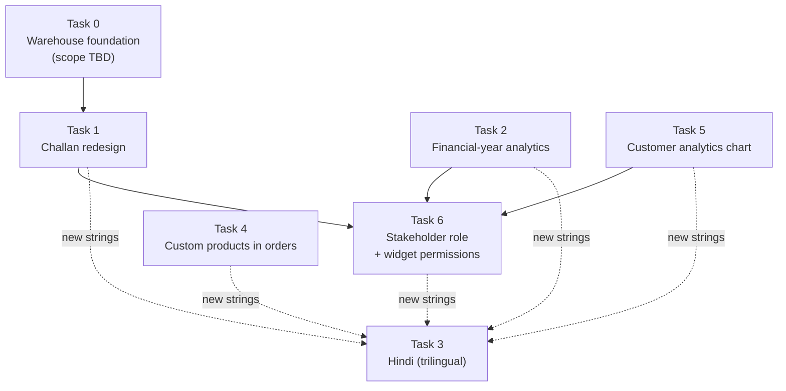

# Master task tracker — Major Feature Update
 
**Created:** 2026-08-02 · **Updated:** 2026-08-05 · **Status:** ✅ All tasks complete (0–6), regression review done

Legend: ⏳ Pending · 🚧 In Progress · ✅ Completed · ⚠️ Blocked
 
Related: [Memory.md](./Memory.md) · [PRD.md](./PRD.md) · [Architecture.md](./Architecture.md) · [RULES.md](./RULES.md)
 
---
 
## 0. Blocking issue — warehouses do not exist
 
**Task 1 assumes a warehouse entity the project does not have.** I searched the
entire codebase: there is no `warehouses` table, no warehouse module, no
warehouse field anywhere. The only occurrences of the word are two marketing
sentences on the public Supply page and a line of help text in the challan form.
 
Task 1 needs warehouses as first-class records — *Warehouse Destination*,
*Source Warehouse*, *Destination Warehouse*. Task 6 additionally asks for
"Warehouse Summary" and "Inventory Summary" stakeholder widgets. And Task 1
opens by saying the module should become "the primary inventory movement and
logistics tracking system", which implies stock balances that actually move.
 
Today `inventory` is a flat table with no warehouse dimension, no UI, and
nothing that ever writes to it — orders do not decrement stock. So "inventory
movement" is not an enhancement of an existing system; it is a new one.
 
**Resolved 2026-08-02.** Scope confirmed as **managed list + challan tracking**:
a `warehouses` table with an admin screen, challans recording source and
destination, and a complete movement history. Live stock balances are
explicitly **out of scope** for this phase and remain Phase 14.
 
Consequence for Task 6: "Inventory Summary" and "Warehouse Summary" widgets can
report *movement* (what came in, what transferred, by warehouse) but not *stock
on hand*, because nothing computes a balance yet. They are scoped accordingly.
 
**Farmer address resolved:** add `farmers.address`, falling back to
`village, block` for farmers enrolled before the column existed.
 
### Secondary findings (not blocking, but they shape the work)
 
| # | Finding | Consequence |
|---|---|---|
| 1 | `farmers` has no `address` column — only `village` and `block` | "Populate the farmer's address" must either compose those two or add a column. Adding one is cleaner and is what a challan needs. |
| 2 | `delivery_challans` already has nullable `farmer_id` + `farmer_name` | The "Other farmer" pattern in Task 1 is **already half-built**. Good news. |
| 3 | `challan_items` already has nullable `product_id` + `product_name` | Task 4's custom-product pattern has a working precedent to copy. |
| 4 | `order_items.product_id` is `NOT NULL REFERENCES products(id)` | Task 4 needs a migration. It touches invoices, quotations, top-products analytics and customer profiles — every consumer must handle a null product. |
| 5 | `profiles.role` is a plain column, no enum constraint found | Adding the Stakeholder role is low-risk. |
 
---
 
## 1. Task overview and dependencies
 

 
**Why this order.** Task 3 (Hindi) runs last of the string-producing work because
every other task adds user-facing text; translating first would mean translating
twice. Task 6 runs after 1, 2 and 5 because a stakeholder cannot be granted a
widget that does not exist yet. Tasks 4 and 5 are independent and could run at
any point.
 
| Task | Depends on | Blocked? |
|---|---|---|
| 0 — Warehouse foundation | — | no — resolved |
| 1 — Challan redesign | Task 0 | no — resolved |
| 2 — Financial-year analytics | — | no |
| 3 — Hindi | all string-producing tasks | no, but scheduled last |
| 4 — Custom products in orders | — | no |
| 5 — Customer analytics chart | — | no |
| 6 — Stakeholder role | 1, 2, 5 | no, but ordered after |
 
---
 
## Task 0 — Warehouse foundation ✅ Completed
 
**Objective.** Give warehouses a home before challans reference them.
 
| # | Subtask | Status |
|---|---|---|
| 0.1 | Decide scope | ✅ Managed list + challan tracking |
| 0.2 | Migration: `warehouses` table | ✅ |
| 0.3 | API: list / create / update / deactivate / delete | ✅ |
| 0.4 | Admin UI for managing warehouses | ✅ |
| 0.5 | Seed a first warehouse in the migration | ✅ |
| 0.6 | ~~`inventory_movements` + balance per warehouse~~ | ➖ Out of scope (Phase 14) |
 
**Delivered.** `database/2026-08-02_warehouses_and_challan_types.sql` ·
`warehouse.controller.js` · `warehouse.validation.js` · `warehouse.admin.routes.js` ·
`WarehouseManagement.jsx` · sidebar entry and route · 15 i18n keys × 2 locales.
 
**Notes.** Deactivate is the normal removal path; hard delete is refused with a
409 once any challan references the warehouse, because that history is the
point of the module. Names are unique case-insensitively so a dropdown cannot
show two "Main" entries. Read access is open to anyone who can raise a challan;
managing the list is super-admin only.
 
**No new dependencies.**
 
---
 
## Task 1 — Redesign Delivery Challan ✅ Completed
 
**Objective.** Two challan types: farmer → warehouse procurement, and
warehouse → warehouse transfer.
 
| # | Subtask | Status |
|---|---|---|
| 1.1 | Migration: `challan_type`, `source_warehouse_id`, `destination_warehouse_id`, `farmer_address` | ✅ |
| 1.2 | Migration: `farmers.address` + fallback to village/block | ✅ |
| 1.3 | Joi: conditional validation per challan type | ✅ |
| 1.4 | Controller: branch on type; keep existing payloads working | ✅ |
| 1.5 | UI: type selector driving which fields show | ✅ |
| 1.6 | UI: farmer select with "Other", auto-filled address | ✅ |
| 1.7 | UI: warehouse selects for both types | ✅ |
| 1.8 | Rename "Received By" → "Dispatched To" in UI **and** PDF | ✅ |
| 1.9 | PDF: render both challan types correctly | ✅ |
| 1.10 | Verify existing challans still open, print and list | ✅ |
 
**Delivered.** Two challan types sharing one table. Procurement takes a farmer
(enrolled or "Other") plus a destination warehouse; a transfer takes both
warehouses and refuses to let them match. The farmer's address is snapshotted
onto the challan at creation, so the document survives later edits to the
farmer record. "Other" writes name and address to the challan only — no farmer
row is created. "Received By" is now "Dispatched To" in the UI and the PDF, and
the PDF's left panel is the source (farmer or warehouse) with type-appropriate
signature lines and footer note.
 
**Files:** `challan.validation.js`, `challan.controller.js`,
`DeliveryChallan.jsx`, `lib/invoice.js`, locales (+47 keys × 2).
 
**Bug found and fixed during testing.** `Joi.valid('warehouse_transfer')` also
matches `undefined`, so a payload without `challan_type` — which is exactly
what the previous client sends — was pushed down the transfer branch and
rejected. Adding `.required()` to the condition fixed it. Caught only because
the test asserted the legacy payload explicitly.
 
**Backward compatibility verified.** Legacy payloads validate and default to
procurement; legacy rows print, with `to` null so the PDF falls back to the
company panel as before.
 
**No new dependencies.**
 
---
 
## Task 2 — Financial-year dashboard analytics ✅ Completed
 
**Objective.** Annual / Quarterly / Monthly views on the Indian FY (1 Apr–31 Mar).
 
| # | Subtask | Status |
|---|---|---|
| 2.1 | `utils/financialYear.js` — FY boundaries, quarters, labels (shared, per RULES) | ✅ |
| 2.2 | Analytics API accepts `period` + `fy` + `quarter`/`month` | ✅ |
| 2.3 | Rewrite dashboard aggregation around the selected range | ✅ |
| 2.4 | Comparison baseline = previous equivalent period, not previous month | ✅ |
| 2.5 | UI: period switcher with FY and sub-period pickers | ✅ |
| 2.6 | Wire every widget to the selected period | ✅ |
| 2.7 | Chart adapts: annual → months, quarterly → months, monthly → days | ✅ |
| 2.8 | Verify totals reconcile across the three views | ✅ |
 
**Risk.** This rewrites the dashboard's core query. The revenue drill-down and
the billable-status rule must survive intact.
 
---
 
## Task 3 — Hindi (trilingual) ✅ Completed
 
**Objective.** Add Hindi alongside English and Odia.
 
| # | Subtask | Status |
|---|---|---|
| 3.1 | `hi.json` covering every key (currently 572, plus whatever tasks 1–6 add) | ✅ |
| 3.2 | Register `hi` in `SUPPORTED_LANGUAGES` | ✅ |
| 3.3 | Widen the server's language validation to `en`/`or`/`hi` | ✅ |
| 3.4 | Account settings selector shows three options | ✅ |
| 3.5 | Verify key parity across all three locales | ✅ |
 
**Note.** Devanagari has the same jsPDF shaping limitation as Odia, so **PDFs
stay English** for Hindi users too. Same single gate in `lib/invoice.js`.
 
---
 
## Task 4 — Custom products in orders ✅ Completed
 
**Objective.** Sell a one-off crop without polluting the catalogue.
 
| # | Subtask | Status |
|---|---|---|
| 4.1 | Migration: `order_items.product_id` nullable + `product_name` | ✅ |
| 4.2 | Joi: require one of `product_id` or `product_name` | ✅ |
| 4.3 | Controller: accept and persist custom lines | ✅ |
| 4.4 | Order form: "Other" option with a name field | ✅ |
| 4.5 | **Consumers:** invoice PDF, quotation PDF, order detail, customer profile, top-products analytics must all handle a null product | ✅ |
| 4.6 | Verify existing orders unaffected | ✅ |
 
**Risk — the real one.** Five places assume `product` is always present.
Subtask 4.5 is the whole task; the schema change is trivial by comparison.
 
---
 
## Task 5 — Customer analytics chart ✅ Completed
 
**Objective.** Bar chart of customers by purchase value.
 
| # | Subtask | Status |
|---|---|---|
| 5.1 | Reuse or extend the existing customer-insights endpoint | ✅ |
| 5.2 | Bar chart: name on X, purchase value on Y | ✅ |
| 5.3 | Order count as the bar label | ✅ |
| 5.4 | Windowed paging with ‹ / › controls | ✅ |
| 5.5 | Sort by value / order count / name | ✅ |
| 5.6 | Empty and single-customer states | ✅ |
 
**Note.** `/api/admin/analytics/customers` already returns per-customer
`total_spent`, `order_count` and `last_order_date`. This is mostly frontend.
 
---
 
## Task 6 — Stakeholder role + per-user dashboard permissions ✅ Completed
 
**Objective.** Give investors and advisors a curated read-only dashboard.
 
| # | Subtask | Status |
|---|---|---|
| 6.1 | Add `stakeholder` to the role list (client + server) | ✅ |
| 6.2 | Migration: `profiles.dashboard_widgets` (JSONB) | ✅ |
| 6.3 | Widget registry — the single list of permissible widgets | ✅ |
| 6.4 | Invite/edit UI: per-widget checkboxes | ✅ |
| 6.5 | **Server-side filtering** of the dashboard payload by permission | ✅ |
| 6.6 | Client renders only permitted widgets | ✅ |
| 6.7 | Sidebar: stakeholders see Dashboard only | ✅ |
| 6.8 | Verify a stakeholder cannot reach operational endpoints | ✅ |
 
**Security note.** 6.5 is not optional. Hiding a widget in the UI while the API
still returns the data is not a permission — anyone can open the network tab.
Filtering happens on the server; the client merely renders what it receives.
 
**Recommended additional stakeholder metrics** (beyond your list): revenue trend
vs the previous financial year · average order value · customer retention (repeat
vs new) · farmer coverage against target · order fulfilment rate.
**Deliberately excluded as operationally sensitive:** cash position, EMI and safe
deploy, individual expenses, audit logs, contact submissions, user management,
per-farmer personal details.
 
---
 
## 2. Regression checklist (before the phase is complete)
 
- [x] Existing challans open, list and print unchanged
- [x] Existing orders, invoices and quotations unchanged
- [x] Dashboard totals reconcile across annual, quarterly and monthly views
- [x] Revenue still counts confirmed + dispatched + delivered
- [x] All three locales have identical key sets; every `t()` resolves
- [x] Every existing role sees exactly what it saw before
- [x] `npm --prefix client run build` passes
- [x] Server boots from `server/.env` alone
- [x] `npx wrangler dev` starts with zero startup errors
- [x] Migrations are idempotent and safe to re-run
 
---
 
## 3. Progress log
 
| Date | Task | Change | Files |
|---|---|---|---|
| 2026-08-02 | — | Tracker created; codebase surveyed; warehouse blocker identified | `TASKS.md` |
| 2026-08-02 | 0 | Warehouse entity: migration, API, admin screen, i18n | migration, `warehouse.*`, `WarehouseManagement.jsx`, `app.js`, `App.jsx`, `Sidebar.jsx`, locales |
| 2026-08-02 | 1 | Two challan types, Other farmer, warehouse routing, Dispatched To | `challan.validation.js`, `challan.controller.js`, `DeliveryChallan.jsx`, `lib/invoice.js`, locales |
| 2026-08-03 | 2 | FY-based analytics: `resolvePeriod`, period switcher, per-grain charts, previous-period baselines | `utils/financialYear.js`, `analytics.controller.js`, `Dashboard.jsx`, locales |
| 2026-08-03 | 4 | Custom products on orders: nullable `product_id`, `product_name`, `lineName()` in every consumer | migration, `order.validation.js`, `order.controller.js`, `OrderManagement.jsx`, `OrderDetail.jsx` |
| 2026-08-03 | 5 | Customer purchase bar chart with sorting and ‹/› paging | `CustomerPurchaseChart.jsx`, `CustomerManagement.jsx`, locales |
| 2026-08-03 | 6 | Stakeholder role, widget registry, server-side payload filtering, per-user grants | migration, `utils/dashboardWidgets.js`, `user.admin.*`, `analytics.controller.js`, `Dashboard.jsx`, `Sidebar.jsx` |
| 2026-08-05 | 3 | Hindi locale (673 keys), `hi` registered, server accepts `en`/`or`/`hi`; PDFs stay English | `locales/hi.json`, `i18n/index.js`, `me.controller.js` |
| 2026-08-05 | 2–6 | **Regression review.** Fixes listed in §4 below | see §4 |
 
---
 
## 4. Regression review — findings and fixes (2026-08-05)
 
The review was run against the finished code, not the plan. Six defects were
found and fixed; each is listed with what would have gone wrong.
 
| # | Defect | Impact if shipped | Fix |
|---|---|---|---|
| 1 | `.or('product_id','product_name')` counted a **blank string** as present | An order line with neither a product nor a name passed Joi and hit the DB CHECK, surfacing as a raw Postgres 23514 instead of a message | `.empty(Joi.valid('', null))` on both fields, so `.or()` sees what the user actually filled in — same fix applied to `challan_items` and `farmer_id`/`farmer_name` |
| 2 | Line-item `object.missing` inherited the **farmer** error message | "Select a farmer" shown when a *product* line was blank | Item schema carries its own `.messages()` |
| 3 | 5 of 17 grantable widgets referenced payload keys the dashboard **never emits** | Ticking "Repeat customer rate" saved a permission that rendered nothing | `repeat_customer_rate` implemented; the other four moved to a documented Future Work block and removed from the registry |
| 4 | 6 granted widgets were rendered inside `{!restricted && …}` blocks | A stakeholder granted "Products summary", "Order status mix", "Total farmers", "Cultivated area" or "Farmer distribution" saw a blank dashboard | Overview cards gated per card; crop chart and order pipeline gated by `can()`; expenses and audit trail stay staff-only |
| 5 | `farmer_distribution_by_crop` read from `/admin/farm/analytics` | Staff-only endpoint — a stakeholder got a silent 403 and an empty chart | Chart now prefers `farmer_distribution` from the dashboard payload; the Farm Ops query is disabled entirely when restricted |
| 6 | `analytics.admin.routes.js` allowed only `super_admin`/`order_manager`/`viewer` | **A stakeholder was 403'd from the one endpoint the whole role depends on** | `/dashboard` allows `stakeholder`; every other analytics route still staff-only |
 
### Verification performed
 
| Check | Result |
|---|---|
| `financialYear` boundaries, Q1→Q4 rollover, past-FY defaults, junk input | 10/10 cases correct |
| Dashboard controller against a mocked Supabase, all 3 grains + 2 FYs | totals, trends, chart buckets and top products all correct |
| Custom product in Top Products | "Wild Ashwagandha" (no `product_id`) aggregates correctly |
| Order-line validation matrix | 10 cases — legacy, custom, blank, null, over-length, bad UUID |
| Challan validation matrix | 13 cases — including a legacy payload with **no** `challan_type` |
| Every widget grant returns data | 13/13 |
| Nothing sensitive leaks with all 13 granted | cash, expenses, audit, recent orders, inquiries, leads all withheld |
| Route authorization by role | stakeholder: 200 on `/analytics/dashboard`, 403 on 11 other admin endpoints |
| Locale parity | en 673 / or 673 / hi 673, zero missing, zero extra |
| Registry ↔ locale ↔ JSX agreement | 13 widgets, 13 labels, 13 render paths, no orphans |
| `npm --prefix client run build` | passes |
| Server boots with `NODE_ENV=production` from a `.env` file | passes |
| `wrangler deploy --dry-run` | bundles, 25 asset files |